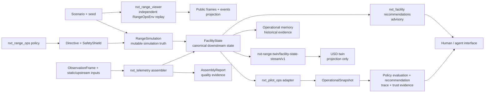
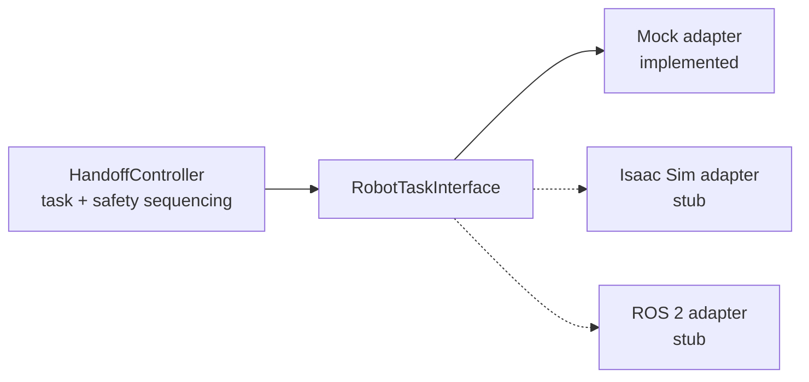
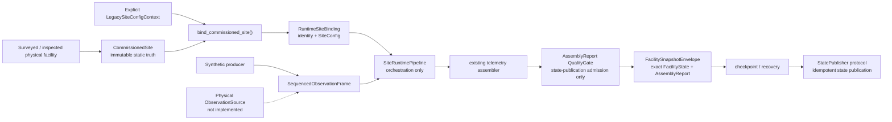
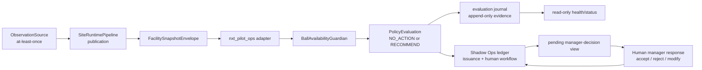
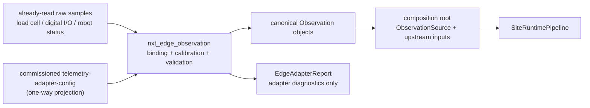

# Architecture invariants

## Site-level data flow

Arrows describe allowed data flow, not permission for every downstream package
to import its upstream. File contracts and composition-root scripts preserve
separation where direct imports are forbidden.

## Robot handoff execution seam

The controller must not know which backend implements the interface. The
current repository validates the mock pipeline; it does not contain physical
robot execution. `RobotTaskInterface` is the micro handoff vocabulary
(navigation, docking, lift/dump, unload verification, retract/return, and
e-stop), not a whole-site collector-dispatch contract.

No LLM, generative agent, Site Runtime, facility recommendation, or Shadow Ops
component may connect directly to this seam. A future physical integration
requires a separately reviewed deterministic admission/controller boundary;
that boundary is not implemented.

## Physical deployment flow and status

Commissioning and Site Runtime are merged contracts. Concrete physical sources,
transports, publishers, command admission, hardware execution, and live-site
service operation are not:

The dashed edge is an absent physical integration. The setup seam calls
`project_legacy_site_config()` with explicit context; `project_site_config()`
remains a static-only projection. Runtime invokes the existing telemetry
assembler with the frame, projected `SiteConfig`, and bound upstream inputs. It
does not pass a previous state, define an alternate assembler, change
`FacilityState`, or perform decision/command admission. `StatePublisher` is an
abstract state port, not a live transport or actuator API. See
[deployment.md](deployment.md) before changing this boundary.

## Agent Runtime composition loop

`nxt_agent_runtime` is the designated deterministic composition/lifecycle
layer over the two merged runtimes. It owns cycle ordering and evaluation
lifecycle evidence only:

The runtime defers the source acknowledgement until the evaluation lifecycle
for the published envelope completes, so an at-least-once source redelivers
any unfinished frame after a crash; deterministic recomputation then
reproduces byte-identical evidence. Rejected input never reaches the
adapter, the guardian, the journal, or the queue. The evaluation checkpoint
is separate from the Site Runtime publication checkpoint. Acceptance in the
queue is a human workflow record only; no path reaches robot execution.

## Edge observation intake

`nxt_edge_observation` is a pure conversion leaf in front of the observation
boundary. It turns already-read raw device payloads into existing canonical
`Observation` objects and reports what it could not convert:

The package imports only `nxt_telemetry.observations` and consumes the
commissioning projection as plain data. It must not import the Site Runtime:
building `SequencedObservationFrame` and satisfying the `ObservationSource`
protocol belong to a composition root, because only `nxt_agent_runtime` may
depend on the runtime. `EdgeAdapterReport` is conversion evidence, never a
second telemetry envelope and never a `FacilityState` input. V0 is
fixture-backed and adds no transport, device connection, register write, or
command surface. See
[`simulation/docs/edge_observation_v0.md`](../../simulation/docs/edge_observation_v0.md).

## Core principles

### One-way extension

Add a new layer as a downstream consumer whenever possible. Do not make stable
upstream runtime packages import presentation, memory, state, telemetry, twin,
Shadow Ops, commissioning, or Site Runtime packages. Keep any necessary
privileged upstream read explicit, small, pure, and guard-tested.

### Pure contracts, privileged adapters

Keep value objects and policy contracts importable without the heavy
simulation stack. Within downstream Site OS packages, concentrate unavoidable
coupling in named seams:

- `nxt_facility.build`
- `nxt_memory.harvest`
- `nxt_telemetry.bank` and `nxt_telemetry.assemble`
- `nxt_pilot_ops.adapters`
- `nxt_site_runtime.pipeline` for the existing telemetry assembly call
- `nxt_site_runtime.composition` for setup-only lazy commissioning projection
- `nxt_agent_runtime` as the only package-level consumer of the Site Runtime
  and Shadow Ops public surfaces together (composition/lifecycle only)
- `nxt_edge_observation` as a pure raw-to-canonical conversion leaf over
  `nxt_telemetry.observations` and the commissioning projection data
- `simulation/scripts/` for cross-package orchestration

Repository-local benchmark and viewer tools are separate consumers of public
`nxt_range_ops` APIs; their permitted coupling is recorded in
[package-map.md](package-map.md).

### Read-only means trajectory-neutral

A downstream observer must not consume simulator RNG, mutate resources, shift
event ordering, or change observation/reward sequences. Existing tests compare
instrumented and uninstrumented episodes byte-for-byte. Preserve that pattern.

### Determinism is a contract

Same inputs and seed must produce stable decisions, traces, identifiers,
records, reports, and artifacts where the package claims determinism. Prefer
canonical serialization, stable ordering, content-derived IDs, explicit time,
and fail-loud schema checks.

### Safety cannot be advisory-only at execution

Advice may pre-filter for feasibility, but execution safety remains inside the
execution layer. Never bypass `SafetyShield` in the macro simulator or adapter
safety contracts in the handoff layer.

For handoff execution, preserve the complete contract, not only the interface
type:

- motion/task calls obey hard timeouts and invalid ordering returns a classified
  failure rather than escaping task control;
- docking and unloading retries are bounded;
- post-docking failure attempts safe lower/undock retraction;
- emergency stop latches until an external reset and no further motion follows
  an e-stop; and
- `HandoffController` remains backend-independent while adapters remain free of
  controller/scenario logic.

## Guarded boundaries

| Boundary | Mechanical authority |
|---|---|
| `nxt_sim` controller/interface/adapter separation | `simulation/tests/test_architecture.py` |
| `nxt_range_ops` pure Phase 0 imports only | `simulation/tests/range_ops/test_eval_and_architecture.py` |
| Facility one-way imports and RNG/trajectory neutrality | `simulation/tests/facility/test_state.py`, `test_regressions.py` |
| Memory purity and no live feedback | `simulation/tests/memory/test_guards.py` |
| Telemetry purity, designated seams, and RNG discipline | `simulation/tests/telemetry/test_guards.py` |
| Twin import isolation, derivation checks, no feedback | `simulation/tests/twin/test_guards_package.py`, `test_guards_stream.py` |
| Shadow Ops adapter-only upstream access and no command surface | `simulation/tests/pilot_ops/test_boundaries.py` |
| Commissioning independence, immutable/static ownership, and one-way projection | `simulation/tests/commissioning/test_guards.py` |
| Site Runtime designated seams, no duplicate domain contracts, and no upstream/consumer dependency | `simulation/tests/site_runtime/test_architecture.py` |
| Agent Runtime approved-surface imports, no execution/network/wall-clock surface, and no reverse dependency | `simulation/tests/agent_runtime/test_architecture.py` |
| Viewer/demo protected upstream trees | `simulation/tests/range_viewer/test_protection.py`, `simulation/tests/range_demo/test_protection.py` |
| Operational Replay artifact-only, read-only leaf boundary | `apps/operational-replay/tests/boundaries.test.ts` |
| Handoff timeout, state-machine, retry/recovery, unload, and e-stop behavior | `simulation/tests/test_state_machine.py`, `test_retry_recovery.py`, `test_unload_retry.py`, `test_emergency_stop.py` |

The `nxt_range_agent` no-direct-`nxt_sim` rule and some viewer/demo presentation
rules are documented but not exhaustively static-tested. Treat them as binding
and add a guard when changing that boundary.

## Forbidden dependency outcomes

- Simulator or robot packages importing FacilityState, memory, telemetry, twin,
  demo, or Shadow Ops.
- Facility/Shadow Ops advisory code importing directives or execution APIs.
- A third facility decision engine, or duplicate recommendation semantics across
  `nxt_facility` and `nxt_pilot_ops` without a named owner and parity/divergence
  contract.
- Twin code importing live simulation packages or adding novel operational
  facts/physics.
- Physical static facts being reconstructed from `SiteConfig`, a simulation
  scenario, telemetry, viewer/layout output, or USD instead of commissioning.
- Site Runtime owning observations, an assembler/state schema, policy,
  projection, memory, or robot execution rather than orchestrating existing
  public contracts.
- Site Runtime's publication-quality gate being treated as decision policy,
  physical command admission, or a robot safety gate.
- An LLM/generative agent calling `RangeSimulation.apply_directive()`,
  `RobotTaskInterface`, adapters, ROS, actuators, or e-stop APIs directly.
- Memory queries affecting current policy or runtime state.
- Core Shadow Ops code importing FacilityState; only adapters may translate it.
- UI/API/report code duplicating ROI formulas.
- Convenience imports that make optional presentation/USD dependencies required
  by pure contracts.

See [package-map.md](package-map.md) for responsibility-by-package details.
