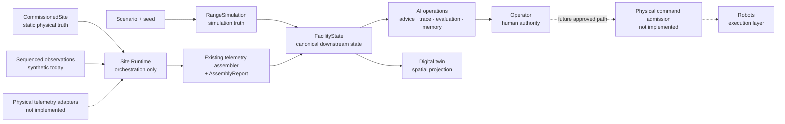

# NXTektal — the AI operating system for autonomous outdoor facilities

NXTektal is building the intelligence layer that turns robots, sensors, and
facility equipment into one autonomous operation. The first domain is golf
driving ranges: a closed-loop environment where demand, collection, handoff,
washing, charging, staffing, and safety must be coordinated continuously.

> **The unit of autonomy is the site, not the robot.**

## The 30-second product view

Robots solve tasks. NXTektal coordinates the facility.

| Layer | Role | Repository evidence |
|---|---|---|
| **AI operations** | Maintains trusted facility state, orchestrates publication-quality state flow, evaluates operating conditions, produces auditable recommendations, and preserves decision evidence | `nxt_commissioning`, `nxt_telemetry`, `nxt_site_runtime`, `nxt_facility`, `nxt_pilot_ops`, `nxt_memory` |
| **Digital twin** | Turns the same operational state into a time-indexed spatial representation | `nxt_range_twin` |
| **Robots** | Execute bounded tasks behind deterministic safety and control interfaces | `nxt_sim`; mock execution is implemented, while the Isaac Sim and physical ROS 2 adapters are stubs |

The simulator is the proving ground, not the product boundary. It creates
reproducible operating days so the state, decision, safety, evaluation, and
spatial layers can be tested before real-site integrations exist.

## How the system fits together



There is deliberately no direct AI-to-actuator path. Recommendations are
advisory; simulated directives pass through `SafetyShield`; robot handoff tasks
pass through `HandoffController` and `RobotTaskInterface`. See
[Architecture](docs/ARCHITECTURE.md) for the source-of-truth and package
boundaries.

## What is working now

On `main`, the repository contains:

- a deterministic whole-range operations simulator with conserved ball
  inventory, demand, collection, handoff, washing, charging, staffing, failures,
  and safety admission;
- a frozen `FacilityState` contract populated from either simulation or the
  observation-assembly path;
- an immutable `CommissionedSite` contract for evidence-backed physical-site
  identity, layout, assets, capabilities, safety limits, and sensor bindings;
- an orchestration-only Site Runtime that validates sequenced inputs, invokes
  the existing assembler, preserves `FacilityState` with `AssemblyReport`, and
  coordinates deterministic checkpoint/recovery and idempotent state
  publication;
- deterministic manager recommendations plus merged Shadow Ops policy
  evaluation, trace, human workflow, and tamper-evident decision records;
- append-only operational memory with no live-loop feedback;
- a reproducible benchmark and read-only operating-day demo;
- a projection-only FacilityState-to-USD digital twin;
- a repository-level AI engineering operating system that codifies truth,
  dependency, safety, testing, and review boundaries; and
- a formula-locked TypeScript ROI engine with evidence-carrying inputs.

Digital Twin Phase 0, Shadow Ops, Commissioning, Site Runtime, and the AI
Engineering Operating System are merged. That does **not** mean the repository
is connected to a physical facility: concrete telemetry adapters, vendor
integrations, production state delivery, physical command admission, automatic
robot execution, live Omniverse/Nucleus delivery, and real-site deployment are
not implemented. The dated status and next gates are in
[Milestones](docs/MILESTONES.md).

## See it

The recommended investor demo replays a seeded operating day through the same
state and decision contracts used by the Site OS, with a synchronized manager
briefing and clearly labeled simulation results.

```bash
cd simulation
uv sync --frozen --extra range-ops --extra demo
uv run --no-sync python scripts/facility_twin_capture.py \
  --scenario demand_spike --policy demand_forecast_dispatch --seed 101
```

Continue with the export and viewer steps in [Demo guide](docs/DEMO.md). The
existing 60–90 second script is in
[`simulation/nxt_range_demo/YC_DEMO.md`](simulation/nxt_range_demo/YC_DEMO.md).

## Repository map

| Path | Purpose | Product status |
|---|---|---|
| `simulation/nxt_range_ops/` | Whole-site operating-day simulation and guarded directive path | Implemented simulation environment |
| `simulation/nxt_facility/` | Canonical downstream state, analysis, and manager advice | Implemented Site OS foundation |
| `simulation/nxt_telemetry/` | Observation contract, synthetic producer, state assembly, and quality report | Contract implemented; physical adapters absent |
| `simulation/nxt_commissioning/` | Immutable physical-site identity, static facts, provenance, and one-way projections | Implemented static onboarding contract; no live values |
| `simulation/nxt_site_runtime/` | Input sequencing, quality-gated state envelopes, checkpoint/recovery, and state-publication coordination | Implemented orchestration library; no physical source, production publisher, or command path |
| `simulation/nxt_pilot_ops/` | Shadow policy evaluation, trace, human workflow, and tamper-evident ledger | Implemented advisory layer; no execution authority |
| `simulation/nxt_memory/` | Append-only operational evidence for offline analysis | Implemented; no live-loop feedback |
| `simulation/nxt_range_twin/` | State/layout validation and USD projection | Implemented projection layer |
| `simulation/nxt_sim/` | Micro handoff controller and robot task interface | Mock backend implemented; physical backends stubbed |
| `simulation/nxt_range_viewer/`, `nxt_range_demo/` | Deterministic replay export and investor presentation | Implemented local demo tooling |
| `nxtektal-roi-engine/` | Versioned, deterministic ROI calculations | Implemented standalone package |
| `AGENTS.md`, `.agent/`, `docs/AGENT_OPERATING_MANUAL.md` | AI engineering governance and architecture-safe workflows | Implemented repository operating system |
| Root Jarvis files | Earlier voice/dashboard experiment | Independent prototype; not part of the Site OS |

The distribution name `nxt-sim` and repository name `jarvis-ai-agent` are
historical. They do not define the product architecture. Package responsibilities
and naming are normalized in [Architecture](docs/ARCHITECTURE.md#package-and-name-map).

## Start here

For a product or investor review:

1. Read this page.
2. Open [Architecture](docs/ARCHITECTURE.md) for the three-layer model and trust
   boundaries.
3. Read [Milestones](docs/MILESTONES.md) for what is merged, still open, and
   not yet built.
4. Run the [Demo guide](docs/DEMO.md).

For engineering work, start with [`simulation/README.md`](simulation/README.md)
and the stable contract docs linked from the architecture guide. The root
dashboard and voice-loop setup has moved to
[Legacy Jarvis prototype](docs/JARVIS_PROTOTYPE.md).

## Claims discipline

This repository demonstrates architecture and reproducibility, not deployed
facility performance:

- all current simulator physical and economic values are explicitly tagged
  placeholders;
- the observation path uses synthetic sensors, not live facility telemetry;
- Site Runtime is a merged orchestration library, not a live service connected
  to physical sensors, vendors, or robots;
- native `FacilityState` does not expose the ETA, yield, capabilities,
  collection permission, current demand, or live washer availability required
  for autonomous collector dispatch, so Shadow Ops fails closed rather than
  inventing them;
- the strongest demo policy is a deterministic rule-based baseline, not a
  trained model;
- the twin is a read-only projection, not a source of operational truth; and
- no LLM, recommendation engine, Site Runtime component, or generative agent
  participates in physical command admission, execution, e-stop, or safety
  loops.
