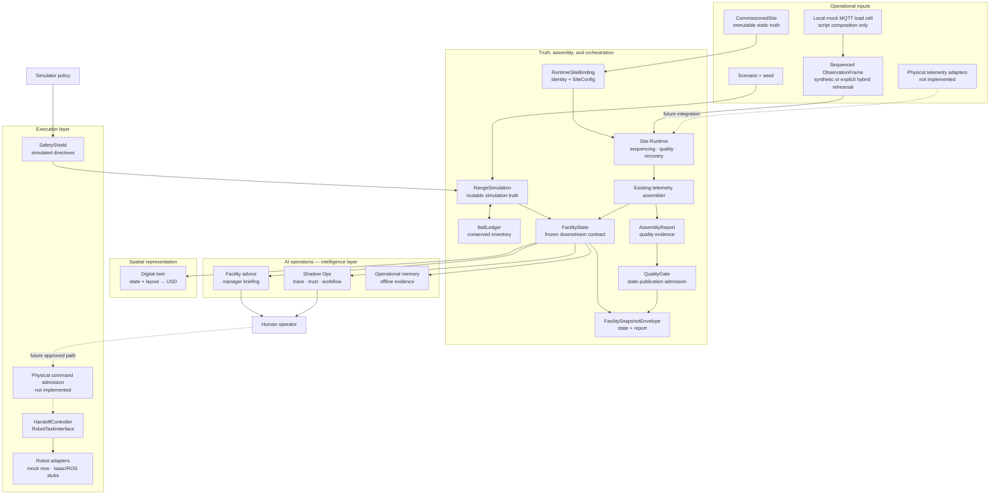

# NXTektal architecture

NXTektal separates facility intelligence, spatial representation, and physical
execution. Those boundaries are the product architecture: the AI operating
layer can improve without turning a visual model into truth or giving a model
direct actuator authority.

## The three product layers

| Layer | Owns | Does not own |
|---|---|---|
| **AI operations — intelligence** | Canonical downstream state, operational analysis, advisory decisions, evidence quality, traceability, and historical learning records | Robot motion, actuator safety, mutable simulation state, or geometry |
| **Digital twin — spatial representation** | A time-indexed, site-identified projection of declared layout and canonical state | Facility truth, policy decisions, inferred physics, or command authority |
| **Robots — execution** | Bounded task execution behind controller, interface, adapter, timeout, retry, recovery, and emergency-stop contracts | Site-level priorities or autonomous policy selection |

`FacilityState` is the interface between operational inputs and the downstream
Site OS. It is frozen and canonical for consumers, but it is not a second
mutable runtime. In simulation, `RangeSimulation` remains live truth and
`BallLedger` remains authoritative for conserved ball counts.

## End-to-end flow

Solid arrows identify merged contracts and the verified synthetic/replay path;
they do not claim a continuously running production service. Dashed arrows are
unimplemented physical integrations. The diagram does not imply that every
downstream package directly imports its upstream; file contracts, designated
adapters, and composition seams preserve package isolation. Commissioning-to-
runtime setup is implemented through `bind_commissioned_site()` and the
explicit `project_legacy_site_config()` compatibility projection. No live
physical observation source or production publisher/sink is implemented. Edge
Gateway Live Input V0 adds a local mock-MQTT load-cell composition under
`simulation/scripts/`; its hybrid mode labels every non-MQTT input as
simulation and does not turn that rehearsal into physical-site truth.

## Source-of-truth boundaries

| Fact | Authority | Downstream representation |
|---|---|---|
| Mutable simulated facility state | `nxt_range_ops.core.sim.RangeSimulation` | `FacilityState`, logs, viewer exports |
| Simulated ball location and count | `BallLedger` | State snapshots and metrics |
| Physical static site facts | Immutable `nxt_commissioning.CommissionedSite` | One-way config/layout/binding projections |
| Site-level state orchestration | `nxt_site_runtime` sequencing, quality gate, envelope, checkpoint/recovery, and state-publication coordination | Exact `FacilityState` plus separate `AssemblyReport`; never advice or commands |
| Continuous evaluation lifecycle | `nxt_agent_runtime` deferred-acknowledgement cycles, evaluation checkpoint, append-only evaluation journal, pending-decision view, and read-only status | References to canonical envelope/trace/recommendation/ledger IDs; never state, policy, or execution truth |
| Canonical downstream operational snapshot | Frozen `nxt_facility.state.FacilityState` | Advice, memory, twin stream |
| Observation provenance and assembly quality | `ObservationFrame` and `AssemblyReport` | Must accompany deployment-path state |
| Raw-device-to-canonical conversion and its diagnostics | `nxt_edge_observation` adapters and `EdgeAdapterReport` | Adapter evidence only; never facility truth, a second telemetry envelope, or a channel registry |
| Local mock-MQTT routing, wire validation, civil-site-time mapping, and process diagnostics | `simulation/scripts/edge_gateway_live_input_v0.py` composition root | Canonical observations in diagnostic mode, or one sensor channel plus explicitly simulated fixture inputs in hybrid mode; never commissioning truth, a core transport dependency, or a physical deployment claim |
| Multi-workflow commissioning readiness | `nxt_workflow_enablement` registry, requirement matrices, verdicts, and content-addressed enablement report | Readiness evidence only; never commissioning truth, state, policy output, or proof a registered capability exists |
| Versioned course spatial truth and map queries | Immutable `nxt_course_world_model.CourseWorldModel` revisions plus the read-only `MapQueryService` | Spatial information only; never commissioned truth, facility state, a live map, twin output, readiness, navigation, a landing model, or a command surface |
| Shadow policy evaluation and workflow evidence | `nxt_pilot_ops` recommendation, trace, workflow, and ledger contracts | Advisory records; never actuator acknowledgement by themselves |
| Viewer replay/output | Independent deterministic `RangeOpsEnv` replay through public APIs | Viewer artifacts; never FacilityState input or upstream truth |
| Dynamic twin projection | Declared layout plus FacilityState stream | USD artifacts; never upstream truth |
| Robot task execution | `HandoffController` through `RobotTaskInterface` | Adapter-specific action and telemetry |

If a twin, dashboard, recommendation, or historical record disagrees with its
input contract, regenerate or fix the projection. Do not promote it to truth.

## Advice and execution are intentionally separate

Two decision surfaces serve different purposes:

- `nxt_facility.decisions` produces broad, deterministic manager advice directly
  from `FacilityState`.
- Shadow Ops (`nxt_pilot_ops`) adds named-policy evaluation,
  trace, trust evidence, human workflow, and a tamper-evident ledger.

Both are advisory. Neither calls directives, robots, ROS, actuators, charging,
motion planning, or emergency-stop APIs. Simulator policies are separate: they
select a closed directive vocabulary that is revalidated by
`RangeSimulation.apply_directive()` and its non-bypassable `SafetyShield`.

Robot execution is also deliberately narrow. `RobotTaskInterface` covers the
micro handoff cycle; it is not a whole-site dispatch or physical command
gateway. A future physical command boundary requires a separately reviewed,
deterministic admission/controller design.

The repository-native Shadow Ops adapter cannot currently issue an autonomous
collector-dispatch recommendation from `FacilityState`: collector capability,
ETA, expected yield, collection permission, current demand, live washer
availability, and timed inbound batches are unavailable. The policy fails
closed and escalates rather than fabricating those facts.

## Site Runtime orchestrates state, not execution

The merged `nxt_site_runtime` validates and orders input, invokes the existing
telemetry assembler, applies a mechanical publication-quality gate, keeps the
exact `FacilityState` and `AssemblyReport` together, and coordinates
checkpoint/recovery plus idempotent state publication. Its `QualityGate` is
data-quality admission for state publication—not operational policy, physical
command admission, or robot safety authorization. `ObservationSource`,
`StatePublisher`, and `RuntimeSink` are protocols and test seams; no concrete
physical source, vendor transport, production delivery service, or actuator
port exists. The script-level Edge Gateway V0 exercises those public contracts
against a local Mosquitto broker and deterministic mock publisher without
moving MQTT, clocks, or device sequencing into Site Runtime. The twin similarly
authors downstream USD artifacts locally; live
Omniverse/Nucleus delivery is not implemented, and USD never feeds operational
truth or policy.

## Package and name map

The repository grew through a sequence of validated milestones, so directory
names reflect implementation history. Use these stable product terms when
orienting a reviewer:

| Repository name | Product-language name | Responsibility |
|---|---|---|
| `nxt_range_ops` | Operations simulation | Whole-site dynamics, directives, safety shield, evaluation |
| `nxt_facility` | Site OS state and advice | `FacilityState`, analysis, recommendations, briefing |
| `nxt_telemetry` | Observation boundary | Evidence contract, synthetic input, assembly, quality report |
| `nxt_memory` | Operational memory | Immutable historical evidence; no live feedback |
| `nxt_range_twin` | Digital twin | File-coupled state/layout validation and USD projection |
| `nxt_pilot_ops` | Shadow Ops | Named-policy evaluation, decision trace, human workflow, and tamper-evident ledger; advisory only |
| `nxt_commissioning` | Facility commissioning | Immutable static site/deployment truth and deterministic one-way projections |
| `nxt_site_runtime` | Site Runtime | Sequencing, state-publication quality, envelope, checkpoint/recovery, and idempotent publication orchestration |
| `nxt_agent_runtime` | Agent Runtime | Deterministic, restart-safe composition of Site Runtime output through Shadow Ops evaluation, with an evaluation checkpoint, evidence journal, pending manager-decision view, and health/status; fixture-backed today, including the explicitly hybrid mock-MQTT rehearsal, and advisory only |
| `nxt_edge_observation` | Edge Observation Adapter Kit V0 | Converts already-read load-cell, digital-I/O, and robot-status samples into canonical `Observation` objects using commissioned bindings, with explicit conversion diagnostics; fixture-backed, no transport, device, or command surface |
| `simulation/scripts/edge_gateway_live_input_v0.py` | Edge Gateway Live Input V0 | Local deployment composition over strict mock-MQTT load-cell input; diagnostic-only or explicitly hybrid/simulated runtime rehearsal, with read-only status and no physical device or command surface |
| `nxt_workflow_enablement` | Pilot Site Workflow Enablement V0 | Registers the three pilot workflow identities, evaluates the shared commissioned site and each workflow's requirements independently, and emits a deterministic enablement report plus fixture-only launch-plan data; readiness gating only, no runtime construction |
| `nxt_course_world_model` | Course World Model V0 | Immutable, versioned course spatial truth — the course-local ENU frame bound to the commissioned coordinate reference, a finite elevation surface, semantic course features, controlled content-addressed map revisions, and the pure read-only Map Query Service; synthetic processed-scan fixtures only, no scan ingestion, navigation, or execution |
| `nxt_sim` | Robot execution lab | Handoff controller, task interface, mock and stub adapters |
| `nxt_range_agent` | Benchmark harness | Reproducible policy evaluation, not a production agent runtime |
| `nxt_range_viewer` / `nxt_range_demo` | Demo and replay | Read-only presentation over exported artifacts |
| `apps/operational-replay` | Operational Replay web app | Read-only browser storytelling over selected exported artifacts |
| `@nxtektal/roi-engine` | ROI engine | Formula-locked economics with evidence-bearing inputs |
| `AGENTS.md` and `.agent/` | AI engineering operating system | Repository truth, dependency, safety, testing, and review governance |

The Python distribution is still named `nxt-sim` because the repository began
as the Virtual Handoff Lab. Renaming it would affect packaging and is not a
documentation-only change; this guide makes the current responsibility map
explicit without pretending the rename has occurred.

## Repository surfaces

The standalone checkout contains three independent implementation surfaces:

1. `simulation/`: the Python simulation and Site OS stack.
2. `nxtektal-roi-engine/`: a standalone deterministic TypeScript package.
3. `apps/operational-replay/`: a standalone read-only Next.js presentation app.

Root documentation and `.agent/` govern all surfaces without creating a
runtime dependency between them.

## Stable technical references

- [`simulation/docs/range_ops.md`](../simulation/docs/range_ops.md): whole-site
  runtime and safety shield.
- [`simulation/docs/facility_state.md`](../simulation/docs/facility_state.md):
  canonical downstream state and manager advice.
- [`simulation/docs/spatial_twin_design.md`](../simulation/docs/spatial_twin_design.md):
  projection-only twin contract.
- [`simulation/docs/shadow_ops_v0.md`](../simulation/docs/shadow_ops_v0.md):
  advisory policy trace, trust, workflow, and ledger contract.
- [`simulation/docs/commissioning_v0.md`](../simulation/docs/commissioning_v0.md):
  immutable physical-site static truth and one-way projections.
- [`simulation/docs/site_runtime_design.md`](../simulation/docs/site_runtime_design.md):
  orchestration-only Site Runtime boundary.
- [`simulation/docs/agent_runtime_v1.md`](../simulation/docs/agent_runtime_v1.md):
  deterministic runtime lifecycle and evaluation composition.
- [`simulation/docs/edge_observation_v0.md`](../simulation/docs/edge_observation_v0.md):
  raw-device-to-canonical-observation conversion, coverage matrix, and the
  absent physical boundary.
- [`simulation/docs/edge_gateway_live_input_v0.md`](../simulation/docs/edge_gateway_live_input_v0.md):
  local mock-MQTT deployment composition, strict wire/time/replay contracts,
  two honest modes, and read-only operations.
- [`simulation/docs/workflow_enablement_v0.md`](../simulation/docs/workflow_enablement_v0.md):
  shared-site gates, independent per-workflow readiness, the deterministic
  enablement report, and the fixture-only launch boundary.
- [`simulation/docs/course_world_model_v0.md`](../simulation/docs/course_world_model_v0.md):
  immutable versioned course spatial truth, the course-local coordinate
  frame, elevation and semantic geometry, map revisions, and the read-only
  Map Query Service boundary.
- [`simulation/docs/architecture.md`](../simulation/docs/architecture.md): micro
  handoff controller and robot interface.
- [`docs/AGENT_OPERATING_MANUAL.md`](AGENT_OPERATING_MANUAL.md): merged AI
  engineering governance and verification model.
- [`nxtektal-roi-engine/docs/api-contract.md`](../nxtektal-roi-engine/docs/api-contract.md):
  ROI contract.
