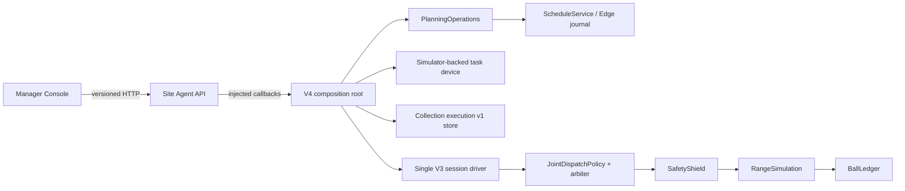

# 连续顺序收球执行 V4：架构设计

日期：2026-09-25

设计基线：`061949cb27f163327b3f9358f97f738006c333f2`

设计分支：`codex/continuous-collection-v4-design`

状态：**IMPLEMENTED AND LOCALLY VERIFIED — UNMERGED。**

## 1. 结论

V4 新增一个持续运行的、可接收多次 Planning 确认的 SIMULATION 服务组合，
但不修改或替换已经通过验证的 3C 固定单任务服务。

V4 的第一阶段是“一个有限 V3 session 内的连续顺序任务”，不是跨天永不结束的
会话管理器。经理可以在同一进程中提交新的 Planning 输入、生成计划并确认；后台
唯一 driver 将确认物化为 schedule、Edge `TASK_CREATED`、V3 binding、持久化
execution request 和 simulator-backed device acceptance。第一条 execution 终态后
driver 继续运行，后续非重叠任务无需重启即可执行。

现有 `nxt-collection-executions/v1` 已支持多条 binding/request/receipt/execution，
并已强制全 session 最多一条 `RUNNING`，因此不升版。需要新版本的是服务能力声明：
V1 把两种 mode 和矩阵冻结，V4 新增
`nxt-pilot-dispatch/service-capabilities/v2` 与
`CONTINUOUS_V3_EXECUTION`。

架构门结论为 **RESHAPE**：不新增领域包、队列真相或第二套调度器；把固定 demo
中的单任务假设留在原入口，在新的 `simulation/scripts/` 组合根中复用现有 Planning、
ScheduleService、Edge、V3 execution store、simulator-backed device、原策略和
SafetyShield。

### 1.1 后续实施说明（2026-10-01）

本节记录设计通过后的实施与验证，不改变 2026-09-25 的设计基线、历史方案比较或
**RESHAPE** 结论。V4 已在一个有限 V3 session 内，用同一进程和唯一后台 driver
通过真实 HTTP 接收两条不重叠 Planning 确认；第一项终态后 session 与 driver 保持
运行，第二项无需重启即可执行。另一个独立空 root 在第一项终态、第二项到期前干净
重启后，复用了相同因果身份并完成第二项。长 driver interval 下重复读取全部 11 条
GET 路由，durable evidence tree 摘要保持不变。

已验证范围仍是确定性的 `SIMULATION`：单一有限 session、单 robot、单 zone、单
handoff station，以及 strict capability V2 Console。它不构成 24/7 跨日会话、真实设备、
视觉巡检、现场性能或商业交付证明。完整复现步骤、实跑 ID、数量、事件和摘要见
[V4 运行手册](../../../simulation/docs/continuous_collection_execution_v4_runbook.md)。

## 2. 为什么需要新入口

当前 3C 服务已证明一条完整闭环，但它有意固定为一个预置 confirmation：

- 启动时自动写入固定 input、plan、confirmation；
- 要求正好一个 confirmation、一个 `TASK_CREATED` 和一个 execution；
- 使用固定 request ID；
- 任一 execution 进入终态后将 driver 标为 `COMPLETED` 并停止；
- Planning input/plan/confirmation 与 schedule/cancel 写入全部关闭。

底层不是单任务模型。V3 store 已能持久化多条请求，arbiter 已按
`(latest_start_sim_t_s, eligible_sim_t_s, execution_id)` 选择待执行项，运行项优先，
并 fail closed 于多个 `RUNNING` lease。浏览器 parser 也已验证多记录的交叉引用、
最多一个运行项，以及后一项开始不得早于前一项终止。

因此，把固定服务原地“改成多任务”会破坏重要的回归基准；建立新的组合入口可以让
3C 继续证明固定闭环，同时让 V4 独立证明持续接入。

## 3. 目标与非目标

### 3.1 本阶段目标

1. 同一 V3 session、同一进程和同一后台 driver 接收至少两次真实 Planning 确认。
2. 每次确认形成不同的 schedule、Edge task、binding、execution 和可恢复回执。
3. 重复 HTTP 请求、UNKNOWN 恢复、进程重启和重复扫描不产生第二次执行。
4. 第一项终态不停止 session；第二项在其排程窗口到来时继续执行。
5. 保留现有单 `RUNNING` lease、原策略非抢占、SafetyShield 最终准入和 BallLedger
   数量权威。
6. Manager Console 准确显示新服务模式、多条执行历史和每项独立状态。

### 3.2 明确不做

- 不连接物理机器人、ROS、真实相机或真实球场。
- 不允许 LLM、浏览器或建议系统直接调用 simulator directive 或设备接口。
- 不新增浏览器 execution POST；execution request 仍只由确定性组合根生成。
- 不改变洗球、补库、库存或 Planning outcome 的独立证据语义。
- 不做多机器人、多站点、跨 session 自动 rollover 或 24/7 跨日运行。
- 不改变同机器人“到期时仍忙”的 Edge 语义；这类 schedule 仍明确拒绝，不暗中延期。
- 不自动把 rejected/missed 任务重新排程。

## 4. 方案比较

### 方案 A（采用）：新的持续 V3 组合服务

保留固定 3C 服务；新服务只负责组合现有 owner。它增量扫描已验证 evidence，
为每个尚未绑定的 `TASK_CREATED` 创建一次 binding，并从 binding 确定性派生
request ID。任务终态与 session 终态分开。

优点是兼容现有回归、复用已验证的持久化和安全路径、失败边界清楚。

### 方案 B（拒绝）：直接扩展固定 demo

改动看似较少，但会把“可重复的单任务 witness”和“可写持续服务”混成一个模式，
使原 3C 验收无法继续证明固定输入闭环，也容易误把固定 marker/root 当作新服务恢复。

### 方案 C（拒绝）：每个任务启动独立进程或 session

隔离容易，但不能证明同一球场 session 内的持续调度、策略让位、共享安全状态和球量
守恒，也无法验证第一项结束后第二项无需重启。

### 方案 D（推迟）：改变 ScheduleService 为忙时自动排队

当前 Edge 在 due time 检测到同机器人已有活动任务时，会持久化拒绝。把它改成“继续
等待”需要新的 schedule 版本、延期规则、优先级、公平性和取消语义。V4 不偷偷引入
这些事实。首版要求计划给同一机器人选择不重叠的窗口；重叠时保留现有可见拒绝。

## 5. 责任边界

| 事实或行为 | 唯一 owner | V4 的使用方式 |
|---|---|---|
| 输入、计划、确认、人工 outcome | `nxt_pilot_ops` Planning v1 | 语义不变；确认仍是人类授权证据 |
| 单日 schedule 与 due-time task admission | `nxt_edge_task.ScheduleService` | 语义不变；不另造队列状态 |
| Edge task/device 生命周期 | `nxt_edge_task` 与 simulator-backed device | 复用持久化、重启和保护规则 |
| 跨 owner 证据验证 | `PlanningOperations` + V4 组合根 | 确认 → schedule → `TASK_CREATED` → binding |
| 运行中模拟状态 | `RangeSimulation` | 唯一可变模拟真相 |
| 球量与位置 | `BallLedger` | 唯一数量来源 |
| 动作选择 | 原 `JointDispatchPolicy` + execution arbiter | execution 只填原策略的 `Wait` 槽 |
| 最终准入 | `SafetyShield` | 不可绕过 |
| binding/request/执行证据 | collection execution v1 store | 多记录、单运行 lease、确定性 replay |
| 服务循环与 HTTP 路由安装 | 新 V4 `simulation/scripts/` 组合根 | 不成为领域真相或第二套状态机 |
| Manager API transport | `nxt_site_agent.api` | 注入 callbacks；仍不得导入 simulator |
| 页面展示与写入门控 | Site Agent Console | 严格 parser；不推断权限或球量 |

允许的依赖方向保持为：



API 和 UI 不导入或调用 DEVICE、DRIVER、SHIELD、SIM。

## 6. 服务与 evidence root

V4 已落地为独立入口和独立 root marker：

- 脚本：`simulation/scripts/course_collection_execution_v4_service.py`；
- marker schema：`nxt-course-continuous-collection-service/v1`；
- service mode：`CONTINUOUS_V3_EXECUTION`。

实施保留了下列冻结合同：

1. V4 `--initialize` 只接受空目录并写入自己的 marker。
2. V4 不打开固定 3C marker；固定服务也不打开 V4 marker。
3. 同一 evidence root 仍只有一个进程锁和一个 V3 driver。
4. HTTP GET 只读取持久 evidence，不触发 recover、schedule tick、binding、admit
   或模拟推进。
5. POST 只写其 owner 的记录；模拟推进和跨 owner materialization 由后台 driver
   独占。

公共运行底座由明确的共享 runtime helper 承担；固定 demo 的 seed、唯一 confirmation
和固定 request ID 仍只存在于固定 wrapper，没有进入 V4 持续服务。精确 fresh、resume
和 read-purity 操作见
[V4 运行手册](../../../simulation/docs/continuous_collection_execution_v4_runbook.md)。

## 7. 唯一后台循环

一次 driver iteration 在同一服务组合锁内按以下顺序执行：

1. 读取当前 V3 runtime status；若 session `ENDED`、session 级 protection 或永久
   failure 已成立，不执行任何写入或 step。
2. `PlanningOperations.recover()`：从 durable confirmation 幂等物化遗漏的 schedule。
3. `ScheduleService.tick(simulation_now)`：按现有 due-time 规则产生最多由 owner
   允许的 `TASK_CREATED`、MISSED 或 REJECTED 证据。
4. 为新 `TASK_CREATED` 增量创建 binding 和 execution request，并调用
   `SimulatorBackedTaskDevice.admit()`；它必须得到正常 ACCEPTED，或完成 §9.1 的
   准入前拒绝闭环，不能留下未受理且非终态的 execution。
5. 排空并发布 device events/status，使 Edge 看到 ACCEPTED/终态证据。
6. 仅调用一次 `course_session_v3.run()`；它是唯一可以推进模拟的路径。
7. `consume_committed()`，再次发布 Edge events/status，然后重新分类服务状态。

HTTP confirmation 成功只证明 confirmation 已持久化。它不在请求线程中运行上述循环，
也不承诺立即开工。下一次 driver iteration 完成 materialization。

进程启动顺序固定为：验证 marker/root → 启动 device 并对账已有 V3 execution →
修复任何准入前拒绝缺口 → 启动 gateway/publisher 并发布状态 → 恢复 Planning/schedule/
binding/request → 完成 classifier → 最后才对外标为 started 并启动 driver。任何一步失败
都保持 API 写入不可用。

`PAUSED` 时 driver 可以继续醒来但不得推进模拟、schedule business clock 或 execution；
Planning 写入仍可作为未来意图保存。恢复后使用冻结的原时间窗口，不重设 due/expiry。

## 8. 增量 binding 与历史输入

现有 binder 会把 `bound_at_sim_t_s` 写入 binding identity。若每轮用“当前时间”重算
所有旧 confirmation，同一个任务会得到不同 binding 并产生冲突。V4 必须：

1. 在 V3 admission lock 下先 replay 已持久化 bindings；
2. 按 `task_id` 排除已经绑定的 confirmation；
3. 每次只把尚未绑定的一项 confirmation 交给 binder；
4. binding 一旦持久化，恢复时只读取并复用，永不重算；
5. 对已 binding 但尚无 durable receipt 的项继续完成 request/device admission。

公开 Planning snapshot 只暴露 `latest_input`，但历史 confirmation 可能引用旧 revision。
V4 的内部 binding snapshot 必须从验证过的 `PlanningHistory.records(INPUT)` 加入
`input_records`，让 binder 精确验证 plan 所引用的历史输入。该字段只用于组合根，
不改变 `/api/v1/planning` 的公开响应。

## 9. 稳定 request 身份与幂等

V4 不使用调用者的 confirmation `request_id`、墙钟、随机 UUID 或仅 `task_id` 作为
execution request identity。binding 已包含 task、V3 session/round 和 runtime 映射，
因此内部 request ID 固定为：

```text
exec_req_ + first24hex(sha256(canonical_json({
  "schema": "nxt-collection-execution-request-id/v1",
  "kind": "EXECUTE_BOUND_COLLECTION",
  "binding_id": binding_id
})))
```

同一 binding 在所有扫描和重启中得到同一 ID。`make_request()` 继续生成 content-derived
`execution_id`；store 同时验证 request ID 同内容重放和同 logical execution 不得出现
不同内容。UNKNOWN 恢复始终先按原 ID GET，再决定是否重发原始内容。

关键崩溃窗口的结果：

| 崩溃位置 | 重启行为 |
|---|---|
| confirmation 后、schedule 前 | Planning recover 物化原 schedule |
| `TASK_CREATED` 后、binding 前 | 普通同 incarnation 进程重启创建一次 binding/request，并继续同一准入尝试 |
| binding 后、request 前 | 普通同 incarnation 进程重启复用 binding 与同 request ID，不建立第二个 attempt |
| request 后、Edge ACCEPTED 前 | 普通同 incarnation 进程重启复用原 request/receipt；可进入 ACCEPTED/PENDING，且不重复 BallLedger move |
| ACCEPTED 或 RUNNING 中 | 现有 device restart 规则给出 FAILED/INCONCLUSIVE 并阻断旧授权 |
| ACCEPTED 前显式 re-provisioning / different incarnation | 冻结的旧 incarnation 触发唯一 seq-0 拒绝并终态化为 `REJECTED/IDENTITY_CONFLICT`；BallLedger move 为零 |
| commit/outbox/cursor 任一边界 | 复用现有 V3 recovery；不重复 BallLedger move |

### 9.1 准入前同 incarnation 续接与 different-incarnation 拒绝闭环

`RobotCore` 的 incarnation 由 provisioning identity 固定。普通进程重启只增加
`boot_sequence`，不会改变 incarnation。已经写入 `TASK_CREATED` 的 `TaskRequest`
若仍指向当前 provisioned incarnation，启动恢复必须复用同一 binding、request body、
request ID、receipt 和 attempt；它可以正常进入 ACCEPTED/PENDING，但不得创建第二个
request/attempt，也不得重复 BallLedger move。

只有显式 re-provisioning 或其他可验证的设备替换使当前 incarnation 与冻结值不同，
才由设备产生 event sequence 0 的 `REJECTED/incarnation_mismatch`。V4 必须同时保留
同 incarnation 续接与 different-incarnation 拒绝两条持久、可重放合同：

1. 同 incarnation 恢复按稳定 request ID 查询或重放原内容，并复用原 receipt/attempt；
   多次扫描或再次重启仍只有一个 request、一个 execution attempt。
2. `SimulatorBackedTaskDevice` 在向 different-incarnation 设备再次发送请求前，先查找
   与 task ID、设备身份和
   `incarnation_mismatch` 精确匹配的已持久 seq-0 REJECTED；存在时复用，禁止再写一条。
3. 没有既有拒绝时，different-incarnation 设备按现有 RobotCore 规则持久化唯一
   seq-0 REJECTED。
4. collection execution store 的内部幂等“准入前设备拒绝”记录只接收验证过的
   Edge `TASK_EVENT_PERSISTED`，不自行判断设备结果。
5. replay 将该 different-incarnation execution 固定为：
   `REJECTED / IDENTITY_CONFLICT / TERMINAL`；
   `started_sim_t_s=null`、无 assignment/action；两组数量保持 `NOT_REACHED`；Edge
   `accepted=false`、`effective_state=REJECTED`、`reason=incarnation_mismatch`、
   `result_verification=VERIFIED`；`conflicts.incarnation_mismatch=true`；设备保护为
   `INCARNATION_MISMATCH` 且 `authorization_blocked=true`。
6. 若 Edge rejection 已写而 V3 terminal 未写就崩溃，启动 reconciliation 必须复用
   原 Edge record ID 完成同一终态；重复或冲突拒绝 fail closed。
7. 服务在完成相应续接或拒绝 reconciliation 前不得标为 started，也不得提供一个
   request 已持久但既未 ACCEPTED、也未终态的 execution snapshot。

这两个分支都不需要改变 `nxt-collection-executions/v1` 的公开字段。different-
incarnation 关闭路径使用 V3 内部 journal record/replay 语义；same-incarnation 路径保留
稳定准入身份。不得把 request-only、尚未 ACCEPTED 的 PENDING 暴露为完成恢复，也不得
把普通进程重启伪装成 incarnation mismatch。

## 10. session、任务与保护生命周期

V4 classifier 扫描全部 execution，不再要求 `len(executions) == 1`。

- `ACTIVE` 且无永久故障/protection：driver 为 `RUNNING`，即使当前没有任务或历史项
  已全部终态也继续。
- `PAUSED`：driver 标 `PAUSED`，不推进；线程和读取服务继续存在。
- 任一 execution `protected` 或 `authorization_blocked`、terminal conflict、replay
  mismatch：整个单机器人 session 进入 `PROTECTED`，停止 driver，禁止新确认的
  execution materialization；GET 与原 request receipt 保持可读。
- session `ENDED`：只有当所有已创建 execution 都终态时进入 `ENDED`；否则 fail
  closed 为 `FAILED`。
- 未捕获的存储、验证、gateway、device 或 driver 异常：`FAILED`，不自动重试动作。

第一项普通 `SUCCEEDED/PARTIAL/REJECTED/MISSED/FAILED` 终态本身不结束 session。
只有带 authorization block 的保护结果才阻止后续任务。

V4 仍是一个有限 session。跨日或下一个 round 的自动创建、证据 rollover 和 UI
切换属于后续版本。

## 11. 排程与重叠窗口

Planning confirmation 仍生成 bound schedule；V4 不开放直接 schedule create。
同一机器人已有活动 Edge task 时，另一条已到期 schedule 按当前 owner 语义被拒绝，
不会自动等待。首个验收 fixture 必须给第二项选择晚于第一项预计闭环的窗口，并验证
第一项终态后第二项才产生 `TASK_CREATED`。

为了避免确认一个必然越过 session 终点的计划，V4 在 confirmation commit 前增加
一个由组合根注入的 session-horizon gate：

- 使用与 binder 相同的 cycle evidence 和控制间隔推导 `max_execution_s`；
- 要求所选 `start_at_utc + max_execution_s <= session end UTC`；
- 要求 robot/zone 存在当前 session 的显式 runtime binding；
- gate 只拒绝不可能在本 session 执行的新 confirmation，不修改 Planning 的计划算法；
- 实际开工延迟后剩余 horizon 不足，仍由 V3 store 终态化为
  `MISSED/INSUFFICIENT_SESSION_HORIZON`。

pending schedule cancellation 可以开放，因为它复用 `ScheduleService.cancel()` 的
pending-only、同锁规则：只能取消尚未产生 task 的确认 schedule；一旦 DISPATCHED
绝不能通过取消按钮撤回 Edge task 或执行授权。

## 12. 服务能力合同 V2

该合同已在
`simulation/docs/contracts/pilot-dispatch-v0/service-capabilities-v2/`、
`simulation/scripts/task_ops_service_capabilities.py` 和
`apps/site-agent-console/lib/task-ops.ts` 落地。固定 3C 和 legacy 服务继续发出 v1
声明，字节与矩阵不变；连续服务发出：

```json
{
  "schema": "nxt-pilot-dispatch/service-capabilities/v2",
  "mode": "CONTINUOUS_V3_EXECUTION",
  "operations": {
    "planning_inputs_create": "SUPPORTED",
    "planning_plans_create": "SUPPORTED",
    "planning_confirmations_create": "SUPPORTED",
    "planning_outcomes_create": "SUPPORTED",
    "schedules_create": "UNAVAILABLE",
    "schedules_cancel": "SUPPORTED",
    "notifications_acknowledge": "SUPPORTED",
    "notifications_resolve": "SUPPORTED"
  }
}
```

选择 v2 的原因是 mode 为封闭枚举；向 v1 添加第三个值会让旧严格客户端对同一版本
产生不同理解。已实现的 console parser 同时接受旧 v1 两种矩阵和新 v2 唯一矩阵；未知版本、
未知 mode 或矩阵不一致继续 fail closed。当前旧客户端看到 v2 会拒绝整份 task-ops
快照并显示 OFFLINE，或在已有快照时保留旧数据并显示 STALE；它不会降级为只读渲染，
但所有写入都会安全关闭。升级后的客户端才显示 continuous mode。

静态 capability 只说明路由已安装，不随运行健康变化。以下动态条件仍独立阻止写入：

- scheduler read 不是新鲜 `RUNNING`；
- session 已 ENDED；
- service FAILED 或 PROTECTED；
- request 内容、revision 或记录级 precondition 失败；
- notification 自身 `can_resolve=false` 或 condition active。

服务在 FAILED/PROTECTED/ENDED 时用现有 scheduler health 门 fail closed，并返回明确
503/409；不把 capability 改成另一份矩阵。

## 13. API 与界面

V4 组合根已安装以下路由，并保持 collection execution 只读：

- `GET /api/v1/planning` 与 request recovery GET；
- Planning input/plan/confirmation/outcome POST；
- `GET /api/v0/task-ops`；
- pending schedule cancel POST；
- notification acknowledge/resolve POST；
- `GET /api/v1/collection-executions`；
- `GET /api/v1/collection-executions/requests/{request_id}`。

`/api/v1/collection-executions` 继续完全只读，任何对应 POST 仍为 405。浏览器不能调用
内部 execution admission。

Console 已实现以下最小变化：

1. parser 和 capability helper 接受 v2 continuous mode；
2. 显示 `CONTINUOUS V3 SESSION`，按矩阵开放 Planning 与 pending cancellation；
3. execution 面板渲染多张卡，保持服务顺序或按已冻结的稳定顺序展示，不自行重排为
   “优先级”；
4. 第一项终态后页面仍显示 session ACTIVE 和后续 PENDING/RUNNING；
5. Planning UNKNOWN、草稿和原 request ID 在能力/健康变化后仍保留；
6. 不新增直接 schedule create 或 execution 操作按钮。

运行时能力、动态健康和 UI 操作方法见
[V4 运行手册](../../../simulation/docs/continuous_collection_execution_v4_runbook.md)。

## 14. 安全与诚实边界

- 全路径仍为 `SIMULATION ONLY`。
- 人类 confirmation 是允许进入模拟执行组合的必要证据；LLM建议本身无执行权。
- 原策略每 tick 仍先运行；execution 只替换 `Wait`，不能抢占非 `Wait` 动作。
- 所有选中动作仍经 `ActionCatalog -> RangeOpsEnv.step() -> apply_directive() ->
  SafetyShield`。
- 数量只来自带 assignment ID 的 BallLedger-backed events。
- task success 不自动写 Planning outcome，不证明洗球、补库或 clean inventory。
- service/API/UI 不新增任何物理命令、e-stop reset 或人工保护解除入口。

## 15. 验收矩阵

### 15.1 核心闭环

1. 两个不同 Planning confirmation 在同一 session 中产生两个不同 schedule/task/
   binding/request/execution；每个交叉引用精确。
2. 第一项已经 `RUNNING` 后，才通过真实 HTTP 提交新的 input/plan/confirmation；
   第二项 due window 晚于第一项闭环。第一项终态后 driver、进程和 session identity
   不变，第二项无需重启进入 RUNNING 并终态。测试不得在启动前预置两项绕过持续接入。
3. 任意时刻 `RUNNING <= 1`，且 `started_sim_t_s(second) >=
   terminal_sim_t_s(first)`。
4. 两项数量都只能由各自 assignment 的 ledger events 得出；总球量继续守恒。

### 15.2 幂等与恢复

5. 重复 input/plan/confirmation POST 与 UNKNOWN recovery 不增加 confirmation、task
   或 execution。
6. 重复后台扫描、重复 `device.admit()` 和重启使用同 request ID/receipt。
7. 分别在 confirmation、schedule、TASK_CREATED、binding、request、设备拒绝、
   ACCEPTED、prepared、commit、outbox、cursor 边界注入崩溃，不重复 Edge terminal
   或 BallLedger move。
8. 第一项终态与第二项 due 之间重启，第二项仍可执行；第一项已 ACCEPTED 或 RUNNING
   时重启则按现有规则 FAILED/INCONCLUSIVE/protected，第二项不得启动。
9. `TASK_CREATED`、binding 或 request 已持久但尚未 ACCEPTED 时，普通同 incarnation
   进程重启复用唯一 request/receipt/attempt，并可恢复为 ACCEPTED/PENDING；后续执行
   不重复 BallLedger move。显式 re-provisioning / different incarnation 则产生一条
   可读的 `REJECTED/IDENTITY_CONFLICT` execution 和唯一 seq-0 Edge rejection，且
   BallLedger move 为零。

### 15.3 失败与边界

10. 同机器人重叠 due schedule 按当前 owner 规则明确 REJECTED，不生成第二个
   `TASK_CREATED` 或 execution。
11. confirmation 越过 session horizon 或缺少 runtime binding 时在 commit 前拒绝，
    零 schedule/task/execution。
12. SafetyShield 拒绝、e-stop、fault、人工协助、terminal conflict、replay mismatch
    均阻止后续启动；GET 和既有 receipt 仍可读。
13. PAUSED 冻结模拟业务时间但不伪装成读连接故障；恢复不重设窗口。
14. session ENDED 时不存在非终态 execution；新写 fail closed。
15. 连续重复 GET 前后 evidence tree digest 不变。
16. pending schedule 可取消且不可恢复；DISPATCHED schedule 取消返回冲突，不影响任务。
17. 用同步屏障并发运行 confirmation POST 与 driver tick、schedule cancel 与 driver tick；
    每种排序都只有一组可线性化证据：确认先提交则由后续 tick 物化，tick 先完成则下轮
    物化；取消先提交则无 task，dispatch 先提交则取消冲突。不得同时出现 CANCELLED 与
    `TASK_CREATED`，也不得重复 execution。

### 15.4 合同、界面与回归

18. capability v1 的固定/legacy fixtures 保持逐字兼容；v2 continuous 矩阵严格验证。
19. 未升级 console 拒绝 v2 task-ops 快照并进入 OFFLINE/STALE；升级 console 只开放
    声明且健康允许的操作。
20. 页面同时显示两条 execution，第一条终态不会让第二条或 session 显示完成。
21. 当前 3C 固定服务、Console 全量回归、collection execution v1 合同、V3
    replay/acceptance 和仓库架构 guard 全部保持通过。

## 16. 实施与实跑记录

### 16.1 任务到提交

| 阶段 | 本地提交 | 已落地内容 |
|---|---|---|
| Task 1 | `c11d44c3da575ed7f2a1c48275108125e3d55aca` | capability V2 schema、producer 与 strict client parser |
| Task 2 | `253322991cc9a84de3409e8bc1d715e2b2e0ec99` | durable pre-acceptance identity rejection |
| Task 3 | `ea779f80836428f40f61b7c8cc4d163c66a9823a` | device-owned rejection reconciliation 与恢复边界 |
| Task 4 | `d322856271927542e81e7cc88b88f2579c25c9d0` | stable binding-derived admission、历史 input 与 horizon gate |
| Task 5 | `dc1e521c4d35ec771bca83c45ab02bbf34ee0e7a` | V4 root、持续 driver 与 session lifecycle |
| Task 6 | `d755934cebdb423bc77e04dcae076cc4cc1ce238` | HTTP route composition、真实双任务 witness 与 backend final |
| Task 7 初版 | `907a5a1de521968bbd899e535eba1e70f32eb84d` | continuous Console mode、能力门控与多 execution 展示 |
| Task 7 review fixes | `a897467b2c3a1689ce6d4f14599e8f581d87473b` | Console review gaps |
| Task 7 causal fixtures | `49d78729c38d3be5e57afe54c4f683ae4ec2bcc8` | producer-backed pending recovery pair |
| Task 7 最终修正 | `27fcea2d4639dc695f57bd342998803967ecbd09` | causal continuous execution snapshot tests |
| Task 8 运行手册初稿 | `e985fbfdbf9a6662ba0d5d4b143e389693833400` | fresh、restart、GET-purity 操作与实跑证据 |
| 依赖安全修正 | `1ea895013784c9cb3731f96902cda65699003ff8` | 两个 Next 应用从 16.3.5 升到 16.3.8，关闭生产依赖 Critical |

最终文档状态提交在本记录之后创建，因此这里不预写未来 SHA。以上提交均为本地、未
推送、未合并。Task 7 的合同/行为与 UI 两路独立复核提出的有效问题已分别通过上述
三个修正提交关闭。

### 16.2 Uninterrupted HTTP proof

2026-10-01 从空 root 启动真实 loopback HTTP 服务。第一条 execution 已 RUNNING 且
出现非零 BallLedger 数量后，才提交第二条 Planning 链。两项在同一进程、同一 driver、
同一有限 session 中依次终态：

| 项 | Execution | 终态 | Raw | Unload | Event digest |
|---|---|---|---:|---:|---|
| 1 | `75ac1b88002c03ecdec352ed27d9c306893ac4c29674c891eac1ddf96808f215` | `SUCCEEDED / UNLOADED_ALL_COLLECTED_BALLS` | 600 | 600 | `8feada8515a152816dbeda7ef12b340344c89eeb6fa7a226462ce865c104cc37` |
| 2 | `125688930584b23999ff42f630c60f77f7daef28019dfb65c033db17151a3a24` | `PARTIAL / ZONE_EMPTY` | 296 | 296 | `69301d39fd20c395d223d142a6f33da261f1dc0b5c0fc1c968acd0642c6fc72a` |

两项 `conservation_passed` 与 `payload_parity_passed` 均为 true；最终 session 仍为
`ACTIVE`，driver 仍为 `RUNNING`，Planning outcomes 为 `[]`。uninterrupted 最终
replay digest 为
`ad3b5c32518050522c753e964ebb751407cd702f2ddb94e27ecbf49000e0d1cd`。

### 16.3 Restart 与 GET purity proof

第二个空 root 在模拟 08:30 干净停止：第一项已 600/600 终态，第二条 schedule 尚未
到 08:40，且没有 task/binding/request/attempt/assignment/ledger movement。省略
`--initialize` 重启后，08:30 immediate snapshot 与停止前 replay digest 均为
`aa3a38bbe90b4501ee74084c1232d1df30eb8a2b862a3a2a8b14eb04f3b3ba52`；随后第二项以
相同因果 ID 到达 `PARTIAL / ZONE_EMPTY / 296/296`。restart 路径最终 replay digest
为 `9dad437eb7940ee2b0c9d6fc0d441bbb7596b99678f39a41cec1ddde50fb248e`。

同一 root 再以 3600 秒 driver interval 启动，两轮各 11 条 GET 均返回 200。排除
`site-agent/` 与 lock 文件后，12 个文件、2,361,065 内容字节的 durable tree 在读取前、
第一轮后和第二轮后摘要均为：

```text
b38ed808ed1c976cf86c7af850f62b3360d2f54b96ae158e301aa1e2e5474efd
```

restart 证据另经独立只读复核，结论为 APPROVED，无 Critical、Important 或 Minor
finding；复核重新计算了 25 个 source event ID 与两项 event digest。运行命令、全部
因果 ID、source events、稳定/可变字段和哈希算法见
[V4 运行手册](../../../simulation/docs/continuous_collection_execution_v4_runbook.md)。

### 16.4 Task 8 验证记录

2026-10-02 使用 locked all-extras Python 3.13.14 环境完成全量验证：3,218 项测试通过；
配置检查 0 errors / 0 warnings；sdist 与 wheel 在仓库外构建并通过 package membership
检查。Site Agent Console 为 26 files / 658 tests，通过 typecheck、production build、
HTTP smoke，lint 为 0 errors / 2 个既有 warnings。仓库政策测试 111 项通过，repository
verifier 检查 732 个路径和 89 个 Markdown 文件通过。

验证期间生产审计发现两个 Next 应用均直接锁定受
`GHSA-vcvr-r3jv-pc5j` 影响的 `next@16.3.5`。依赖安全提交 `1ea8950` 将 `next` 与
`eslint-config-next` 精确升级到 16.3.8；Site Agent Console 保持 658/658，Operational
Replay 保持 81/81，两个应用的 typecheck、lint、build、HTTP smoke 和 production
audit 均通过，production vulnerabilities 均为 0。Operational Replay 的 12-scene
responsive/browser fallback 验证也通过。完整审计仍各报告一个只存在于开发依赖图的
transitive `brace-expansion` High，不属于生产图，也未在这次 Next 修正中扩大依赖范围。

最终两路独立 review 与 clean-head focused verification 仍在本记录创建时进行；其结论
必须在最终状态提交中按实际结果补写。

## 17. 原实施分层建议（历史）

以下是 2026-09-25 的依赖顺序。Tasks 1–7 已按该顺序实施；保留原文用于说明设计到
实现的追溯关系：

正式实施计划应按以下依赖顺序拆分，不能先开 UI 按钮：

1. capability v2 schema/docs/parser 与冻结 fixtures；
2. 稳定 request ID、内部历史 input snapshot 和 horizon gate 的纯逻辑；
3. 准入前设备拒绝的持久 record/replay、device reconciliation 与崩溃测试；
4. 新 V4 evidence root/runtime 与增量 materialization；
5. session-level driver lifecycle、保护和重启集成；
6. API capability/route 安装；
7. Console mode/gating/multi-record 验收；
8. 双任务真实 HTTP 演示、全量回归与独立代码审查。

每层先写失败测试，再实现。任何阶段若需要改变 schedule busy 语义、collection
execution v1、单 RUNNING lease 或 SafetyShield 路径，必须停止并重新进行架构审查。
