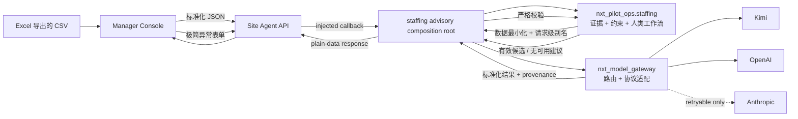

# 区域化 AI 插口与员工异常排班建议 V1：架构设计

日期：2026-10-03

设计基线：`907a5a1de521968bbd899e535eba1e70f32eb84d`
（`feat/continuous-collection-v4-console`，包含 Site Agent、Manager Console、Planning V1
与 Continuous Collection V4；该基线不是 `origin/main`。）

设计分支：`codex/ai-advisory-gateway-v1-design`

状态：**APPROVED FOR IMPLEMENTATION PLANNING — NOT IMPLEMENTED — 用户于 2026-10-03 批准设计。**

## 1. 结论

V1 新增一个可替换的区域化模型插口，以及一个经理端的极简员工异常录入与排班建议
流程：

- 中国部署只调用 Kimi；不因故障把中国部署自动切到境外供应商；
- 海外部署以 OpenAI 为主，仅在连接错误、超时、HTTP 408、HTTP 429 或服务端
  `5xx` 时尝试一次 Anthropic；
- 正常员工资料和常规班表通过一次性 CSV 导入；日常只录入请假、迟到、提前离岗或
  临时不可用；
- 模型最多生成两套候选调整方案；所有候选必须经过确定性岗位、技能、时间、工时和
  覆盖约束校验；
- 经理可接受、修改或拒绝；接受只形成可审计的本地处理方案，不写 HR、工资、门禁、
  Edge task、模拟 directive 或机器人命令；
- 所有模型不可用时，异常仍被可靠记录，现有规则、Planning、Site Agent、Edge 与
  Manager Console 的其他功能继续工作。

架构门结论为 **RESHAPE → PROCEED**：拒绝把供应商 SDK 或 LLM 调用放进
`nxt_agent_runtime`、`nxt_site_agent` 或浏览器，也拒绝建立第三套运营决策引擎。
员工异常、约束校验、建议证据和经理响应语义放在现有决策信任 owner
`nxt_pilot_ops`；新的 `nxt_model_gateway` 只拥有供应商中立的生成请求、协议适配、
路由和调用结果，不拥有任何排班或球场决策语义。两者只在
`simulation/scripts/` 组合根中相遇。

## 2. 用户目标与成功标准

用户希望先让软件单独接入球场运营，在机器人准备好之前收集数据、按现有人手提出
排班建议，并处理员工临时请假等突发情况。首版必须减少而不是增加现场录入负担，且
不能依赖 VPN 才能维持核心运营。

V1 成功标准：

1. 初次使用可从 Excel 导出的 CSV 一次导入员工、岗位、技能、每周常规班次和最低覆盖
   需求；后续自然日可从同一有效 revision 生成班次，不要求逐人或逐日重新输入。
2. 日常正常情况零录入；单班次员工的异常默认只需选择员工、类型并提交，迟到/早退
   只额外选择一个时间点；交互预算不超过 5 次选择/点击且不强制填写文字备注。
3. 一次异常触发最多两套结构化候选方案；未知员工、无资质调岗、时间重叠、超过显式
   工时上限或造成最低覆盖缺口的候选不能成为可接受方案。
4. 中国与海外部署按显式配置路由，不用 IP、语言、浏览器地区或模型自行判断地区。
5. 海外主备切换只能由预先冻结的可用性故障触发；不得因回答质量、拒答或业务结果
   不喜欢而偷偷换模型。
6. 模型、网络或密钥故障不会阻止异常记录、人工处理、既有规则计算或任何现有服务
   读取。
7. 模型层与员工建议层都不存在到机器人、ROS、执行适配器、急停、Edge task 或
   `RangeSimulation.apply_directive()` 的依赖路径。

## 3. 当前状态与基线约束

设计基线上的既有事实：

- `nxt_agent_runtime` 是确定性 Site Runtime + Shadow Ops 生命周期层，明确禁止网络、
  墙钟和 LLM 进入评价循环。
- `nxt_site_agent` 是 loopback-only、fixture-backed 的应用壳；其架构 guard 禁止
  OpenAI、Anthropic、LLM、prompt、completion 等模式进入包内。
- `/api/v1/planning` 已证明一种可复用的边界：Site Agent 只做 HTTP 传输，领域操作由
  `simulation/scripts/` 注入 callback，Site Agent 不导入 Planning 或 Edge owner。
- `nxt_pilot_ops` 已拥有政策特定的输入证据、确定性计划计算、信任、trace、人类工作流
  和追加式记录；它没有员工 roster 或缺勤排班模型。
- `nxt_facility.decisions` 与 Guardian 都没有员工名单、请假、班次覆盖或替班规则。
  对 `staffing`、`employee`、`absence`、`workforce` 和相关中文词的重复搜索未发现另一
  个员工排班实现。
- 仓库当前没有 OpenAI、Anthropic 或 Kimi 运行时 SDK，也没有供应商专属 prompt 或
  返回格式耦合。
- 当前 Site Agent 无身份认证且只允许 loopback；本设计不把它变成公网、多站点或生产
  服务。

分支约束：本设计以未合并的 `feat/continuous-collection-v4-console@907a5a1` 为基线。
实现必须保持为该分支上的 stacked work，或在该分支合并后显式重放；不得把本设计
描述为已进入 `origin/main`。

## 4. 方案比较

### 方案 A（采用）：纯模型网关 + 现有 Shadow Ops owner + 组合根

新增无领域语义的 `nxt_model_gateway`，负责三种供应商协议、地区路由、deadline、
失败分类和标准化调用证据。`nxt_pilot_ops` 新增员工排班证据与确定性约束校验，但不
导入网关。组合根读取密钥、构造两侧并完成一次调用。Site Agent 继续只转发注入的
`/api/v1/staffing` callback。

优点：模型容易替换；员工语义有单一 owner；核心确定性循环不受网络影响；依赖方向
可被机械 guard；现有 Planning callback 模式可复用。

### 方案 B（拒绝）：把三家 SDK 直接放入 Site Agent

代码看似较少，但会使应用壳同时拥有供应商、prompt、重试和排班语义，破坏现有
LLM-pattern guard，并让 fixture 生命周期与外部网络故障耦合。未来更换模型时还会
修改 Manager API owner。

### 方案 C（推迟）：独立部署的云端 AI 微服务

隔离和多站点扩展更好，但需要认证、租户、远程配置、网络安全、可观测性和独立部署
管线。当前 Site Agent 仍是 loopback fixture 服务，首版引入远程微服务会把试点范围
扩大到尚未设计的生产平台。

### 方案 D（拒绝）：用模型替换现有规则或直接生成执行任务

这会破坏确定性回放、既有 recommendation owner 和安全边界，并建立未获批准的
LLM-to-execution 路径。模型只能提出未经信任的候选；确定性校验和人类决策不可省略。

## 5. 架构门与边界卡

### 5.1 事实、行为和 owner

| 事实或行为 | 单一 owner | V1 的关系 |
|---|---|---|
| 导入的员工、班次、岗位、技能和覆盖需求证据 | `nxt_pilot_ops.staffing` | 操作者提供的版本化试点输入；不是 HR、工资或门禁真相 |
| 员工异常、撤销和更正记录 | `nxt_pilot_ops.staffing` | 追加式证据；更正用新记录，不重写历史 |
| 排班候选的确定性合法性 | `nxt_pilot_ops.staffing` | 对模型候选逐项校验；模型不能覆盖结果 |
| 每个服务日的当前 advisory staffing plan | `nxt_pilot_ops.staffing` | roster + 活动异常 + 已接受方案形成的版本化本地建议基线；不是正式 HR 班表 |
| 经理接受、修改、拒绝 | `nxt_pilot_ops.staffing` | 人类工作流证据；不自动应用到外部系统 |
| 通用模型请求/结果合同与供应商协议映射 | `nxt_model_gateway` | 无员工、球场、Planning、机器人或执行语义 |
| 区域路由与允许的故障切换 | `nxt_model_gateway` | 由显式配置决定；不根据内容动态路由 |
| API 传输 | `nxt_site_agent` | 注入 callback；不导入两个 owner，也不解释 payload |
| 密钥、模型 ID、地区配置和 owner 组合 | `simulation/scripts/` | composition root；密钥不进入领域包或浏览器 |
| 页面录入与展示 | `apps/site-agent-console` | API-only presentation；不在浏览器实现约束算法 |
| 正式 HR/工资/考勤事实 | 未实现 | 本阶段只保留操作员导入/录入的试点证据 |
| 物理任务、机器人或执行 | 既有执行 owner | 完全不可达；本设计不改变任何执行合同 |

### 5.2 新包成立条件

`nxt_model_gateway` 拥有一种既有包都不适合承载的事实和生命周期：外部模型供应商
协议、一次生成尝试、地区路由和标准化调用结果。它不是决策引擎，也不保存员工领域
记录。

必须满足：

- 不导入任何其他 `nxt_*` 包；
- 不包含 FacilityState、OperationalSnapshot、员工、班次、球场 Planning、Edge、
  directive、机器人、ROS、actuator 或 e-stop 类型；
- 除 `simulation/scripts/` 组合根外，现有 Python 包不得导入它；
- 使用独立 architecture guard 验证允许的 stdlib、禁止的第一方依赖、执行词和反向
  依赖；
- 加入 wheel/manifest、package map 与测试工作流时必须同步更新文档；
- 不拥有持久化 store；调用证据由调用方写入员工建议 ledger，避免第二份真相。

### 5.3 来源层级和安全边界

导入 roster 和异常是 **operator-supplied evidence**；模型输出是 **untrusted
proposal**；确定性校验后的候选仍只是 **advice**；经理响应是 **human workflow
evidence**。其中没有一层是 FacilityState、模拟运行真相、物理命令或执行确认。

任何接受按钮、模型 tool-call 语法或 provider 返回值都不得调用：

- `RangeSimulation.apply_directive()` 或 `SafetyShield`；
- `RobotTaskInterface`、adapter、ROS/Nav2、actuator 或 e-stop；
- `nxt_edge_task` 的 schedule/task admission；
- Planning confirmation 或 collection execution admission。

架构门结果：**PROCEED**，前提是实施严格采用本边界卡；若需要把接受结果变成正式
班表、HR 写入、Edge task 或机器人行为，必须暂停并重新设计。

## 6. 依赖与数据流

### 6.1 数据流



### 6.2 场内小 PC

试点默认每个球场部署一台常开的小 PC 作为现场 gateway。它运行 Site Agent、组合服务、
本地 staffing ledger 和 Manager Console，不在本地运行大模型；AI 推理通过受控的出站
HTTPS 调用区域供应商，因此不需要 GPU。4 核 CPU、8–16 GB 内存和 256 GB SSD 可作为
采购起点，但不是经过容量测试的最低规格；首台试点机应以实际日志与负载结果校准。

由于当前 Site Agent 仍是 loopback-only，V1 的 Manager Console 默认从这台小 PC 的本机
浏览器访问。开放给手机、其他局域网设备或公网访问需要认证、TLS、网络策略和多用户
权限设计，不包含在本阶段。断网或 provider 故障时，小 PC 仍能记录异常、读取既有证据
并支持人工处理，只暂停新 AI 建议。

未来机器人接入仍通过既有 Edge/robot owner 和单独批准的执行合同；现场小 PC 的存在不
授权模型网关直接访问机器人。

### 6.3 禁止的反向依赖

- `nxt_pilot_ops` 不导入 `nxt_model_gateway`、Site Agent、Console 或 scripts；
- `nxt_model_gateway` 不导入任何 `nxt_*` 包；
- `nxt_site_agent` 不导入 `nxt_model_gateway` 或新增 staffing 模块；
- Console 不导入 Python 实现，不持久化密钥，不复制排班校验规则；
- Agent Runtime、Site Runtime、Facility、Edge、robot packages 对新增层保持完全未知。

## 7. 员工输入与极简异常入口

### 7.1 一次性 roster 导入

Console 在浏览器中解析 UTF-8 CSV，并把严格 JSON 发送给 API；服务端不接收 Excel
二进制或 multipart 文件。Excel 用户可使用提供的模板并导出 CSV。浏览器校验只用于
即时反馈；服务端领域 owner 必须重新执行完整 schema、枚举、时间和交叉引用校验。

每个输入 revision 包含：

- `site_id`、`deployment_id`、IANA 时区、`effective_from_local_date` 和可选
  `effective_until_local_date`；
- `staff_id`（稳定的内部编号，仅在本地使用）与本地展示名；
- 员工持有的 skill code、明确允许的 `(role_code, area_code)` eligibility tuples、每周可
  工作时间，以及按星期定义的常规岗位/区域/班次；
- 全局有效的 `(role_code, area_code)` assignment rules 及每个 tuple 所需的 skill codes；
- 操作者声明的单日最大排班分钟数；该值是试点约束，不宣称自动满足劳动法规；
- 按星期、岗位、区域和时间窗定义的最低覆盖需求；
- `request_id`、输入 revision、导入操作者、显式 UTC 记录时间和 source provenance。

岗位、技能和区域使用服务端验证的 canonical code（`[A-Z][A-Z0-9_]{0,31}`）；人类
展示标签只留在本地，不进入 prompt。每个常规 assignment 也必须引用一个已声明 rule，
员工 eligibility 必须包含对应 tuple，且员工 skill set 必须覆盖 rule 的 required skills。
V1 每名员工在一个服务日最多物化一段常规班次；跨午夜班次、复杂轮休和例外节假日表
不支持，需通过新的完整 revision 表达。

读取某个 `service_date` 时，系统选择该日期生效的最新完整 roster revision，并从星期
模板物化班次、可工作时间和覆盖需求。时间精度为整分钟、秒必须为零，区间统一采用
半开区间 `[start, end)`；本地时间通过 revision 的 IANA 时区转换为 aware instant。
DST 不存在或有歧义的本地时间 fail closed，不自行猜测偏移。新 revision 不重写旧
revision；它只从自己的生效日期开始成为基线，并使基于旧 revision 的待确认候选过期。

CSV 解析失败、重复员工 ID、未知/非法 code、无效时区、非递增或重叠时间、同日多班、
文本字段包含电子表格公式前缀，或缺少覆盖需求时整批拒绝；不得部分导入。展示名和真实
`staff_id` 仅在本地记录/UI 中使用，不进入 provider payload。

### 7.2 极简异常表单

经理端默认使用球场当前 `service_date`；该日期由 composition root 注入的 UTC audit clock
结合 roster IANA 时区得出，浏览器只显示、不提供权威时间。表单只显示：

1. 员工搜索/选择；
2. 异常类型：`LEAVE`、`LATE`、`EARLY_DEPARTURE`、`UNAVAILABLE`；
3. `LATE` 或 `EARLY_DEPARTURE` 所需的一个时间点；
4. 可选备注；
5. 提交。

四种类型在领域层都归一为一个不可工作半开区间：`LEAVE` 和 `UNAVAILABLE` 默认整段
班次；`LATE` 为 `[班次开始, 实际可到岗时间)`；`EARLY_DEPARTURE` 为
`[实际离岗时间, 班次结束)`。时间点必须是班次内的整分钟；V1 不接受跨日异常。员工在
所选日期没有班次、同一员工的活动异常区间重叠，或取消/更正使用了过期 revision 时
fail closed；相邻但不重叠的区间可以并存。

异常记录必须引用现有 roster revision 和已知员工。备注保存在本地 audit record，默认
不发送给模型；上限 500 个 Unicode scalar，控制字符被拒绝。撤销写入
`exception_cancelled`；更正写入单条复合 `exception_corrected` 事件，其中同时引用旧
异常并携带 replacement，避免“已取消但新异常未提交”的半状态；历史记录不被覆盖。
每个 mutating request 的幂等键为
`(site_id, deployment_id, operation_kind, request_id)`；相同键与相同 canonical payload
返回原 receipt，相同键的不同 payload 返回冲突。取消/更正在 ledger 锁内核对
`expected_exception_set_revision`，与并发生成或修改形成明确冲突。

## 8. 员工建议领域合同

员工建议语义归 `nxt_pilot_ops.staffing`，并与既有球量 Planning、Facility advice 和
Guardian recommendation 保持明确 intentional divergence；V1 不聚合、排序、去重或
解决它们之间的冲突。

### 8.1 每个服务日的有效建议基线

每次生成冻结一个 `StaffingBasis`：`service_date`、`roster_revision`、
`exception_set_revision`、`effective_plan_revision` 及三者的 canonical digest。领域层先从
每周 roster 物化该日期的基础班次；若同一 roster revision 上已有经理接受/修改的方案，
则使用最新的完整 validated schedule 作为当前 advisory plan。随后把当前活动异常覆盖到
该 plan：与不可工作区间重叠的 assignment 被确定性切分或移除，形成模型可调整的基线。

每次接受/修改都保存一个完整 validated schedule，并递增该服务日的
`effective_plan_revision`；它取代之前的 advisory plan 作为后续建议基线，但历史证据保持
不变。拒绝不改变 plan。相同 basis 上并行生成的多个 suggestion 中，一项被接受后，其他
项因 plan revision 变化而过期，不能再次接受。

新 roster revision、异常新增/取消/更正都会使旧 suggestion 过期。若异常在方案接受后
被取消，现有 plan 标记为 `REVIEW_REQUIRED`，不会偷偷恢复或撤销已建议的调班；经理需
重新生成或转为人工处理。该 effective plan 仍只是小 PC 上的建议证据，不是
正式 HR 班表，也不触发通知或执行。

### 8.2 发送给模型的最小数据

provider request 只包含：

- 本次 generation 专用的临时 `worker_alias` 与 `assignment_alias`；
- canonical role/skill/area code、可工作区间、当前 advisory assignments 和显式最大分钟；
- role/area assignment rule 及其 canonical required skill codes；
- 当前活动异常形成的不可工作区间；
- 冻结的最低覆盖需求；
- 服务日、站点 IANA timezone、输出 JSON Schema、语言和 prompt template version。

组合根为每个已持久化的 generation reservation 注入新的 alias nonce；领域 projector 用该
nonce 生成只在本请求有效的 alias，并把 alias 映射保存在本地 operation evidence。领域层
保留 `bytes` 且至少 16 字节的注入合同，测试可注入固定 nonce；生产 continuous service
必须为每次新 reservation 调用 stdlib CSPRNG `secrets.token_bytes(32)`，不得从时间、计数器、
request ID、配置或可预测 PRNG 派生，也不得复用。nonce 本身不持久化，nonce digest 只作
本地重复检测，两者都不进入 provider request、公开 API 或日志。这里是数据最小化和假名化，
不宣称匿名化：角色、技能、时间与异常模式仍可能构成准标识符。

`StaffingBasis`、roster、exception-set 和 effective-plan digest 只保留在本地 projection、
reservation 与完整性校验中，不进入 provider-wire primitive 或 prompt。它们是无密钥、跨
generation 稳定的本地关联指纹，模型既不需要它们推理，也不需要它们校验输出，因此不向
Kimi、OpenAI 或 Anthropic 发送。

明确排除：真实 `staff_id`、展示名、自由文本 role/skill/area label、电话、邮箱、自由
文本备注、API 密钥、历史模型回答、FacilityState 原始对象、机器人状态和任何执行工具。

模型输入使用专用 provider-wire primitive，而不是账本的通用 canonical serializer。所有
assignment、availability、unavailable 和 coverage 时间先转换到冻结的站点 IANA timezone，
再渲染成带当地显式 offset 的 RFC3339（零 offset 规范化为 `Z`）；primitive 同时携带 service date 和 IANA timezone，
使模型能够在 `+08:00` 和 DST fold 等场景生成可被同一站点规则验证的 ADD。账本/digest 的
通用 UTC 序列化保持不变。

### 8.3 模型输出与 patch 语义

领域输出协议最多包含两个候选。每个候选只允许：

- 候选本地序号；
- 最多 32 项有序 patch operation；
- 简短理由；
- 最多 5 项纯文本 `operational_warnings`。

同一份 adapter-facing schema 必须落在三家**共同承诺的结构子集**：只使用 `type`、
`properties`、`required`、`additionalProperties`、`items`、`anyOf`、`enum`；根是 object、
所有 object 字段全部 required 且 `additionalProperties:false`，REMOVE/ADD 的嵌套判别联合
使用 `anyOf` 与互斥 required-field sets；只有 candidate index 使用 enum。`operation` 在 schema
中是 string，由 prompt 要求 canonical uppercase `ADD|REMOVE`，领域边界接受 exact ASCII
大小写变体后归一为内部 uppercase，并要求值与字段分支一致，以容忍 Anthropic 官方记录的
strict-output enum case drift。schema 不携带 `$schema`/引用/条件等 dialect 元数据，也不使用
`pattern`、`maxLength`、`maxItems` 等非共同保证的约束。数量、文本长度、canonical code
和 timestamp 词法继续由有响应字节上限的本地域解析器严格执行，因此约束没有放松，只是
避免 provider 在接收请求时因方言不兼容直接 400。

本地仍显式用 Draft 2020-12 validator 校验这份无 meta-key 的结构 schema。三家 adapter 的
prepared-body 测试递归检查 exact schema equality/关键词 allowlist，并要求 Kimi、OpenAI 的
schema wrapper 与 Anthropic tool definition 都设置 `strict:true`。依据是
[Kimi response_format 指南](https://platform.kimi.com/docs/guide/response_format)及其
[MFJS 规范](https://github.com/MoonshotAI/walle/blob/main/docs/mfjs-spec.zh.md)、
[Anthropic Structured Outputs 限制与 enum casing 例外](https://platform.claude.com/docs/en/build-with-claude/structured-outputs#invalid-outputs)
和 [OpenAI Structured Outputs 子集](https://developers.openai.com/api/docs/guides/structured-outputs#supported-schemas)：
Anthropic 明确不支持 `maxLength`/`maxItems`，Kimi MFJS 未承诺 `pattern`/长度/数量关键字，
而三家都承诺上述结构关键词。

patch 只有两种 exact operation：

- `REMOVE`：只含一个当前基线中的 `assignment_alias`；
- `ADD`：只含 `worker_alias`、canonical role/area code，以及带显式 UTC offset 的
  `start_at` / `end_at`。

模型应输出 canonical uppercase operation。领域只额外容忍其 ASCII 大小写变体并立即规范化；
不接受空白、Unicode lookalike、未知值，且 `remove` 搭配 ADD 字段或 `add` 搭配 REMOVE 字段
仍使整份 provider result 无效。

移动、替换或切分必须明确表达为 `REMOVE` 后跟一个或多个 `ADD`；不允许隐式修改现有
assignment。领域层先应用全部 REMOVE，再按数组顺序应用 ADD。未知 alias、重复
assignment alias、重复 REMOVE、未知 code、越界时间、未知字段或第三个候选使整个
provider result 无效。同一 worker alias 可出现在多个不重叠 ADD 中。

这里的 provider-result 结构失败边界是词法/协议边界：`code` 不匹配 canonical
`[A-Z][A-Z0-9_]{0,31}`，时间不是可解析且带显式 offset 的 RFC3339 值，alias 不属于本次
reservation，或同一候选内重复 REMOVE。不同候选可以各自引用同一基线 alias，因为候选
彼此独立。词法合法但 basis 中不存在的 role-area tuple、`end <= start`、非整分钟、offset
与站点 IANA 时区不一致、落在服务日或 availability 之外等属于下一节的逐候选确定性语义
拒绝；因此一个此类无效候选不会吞掉另一个有效候选。

V1 的 provider timestamp 词法固定为
`YYYY-MM-DDTHH:MM:SS[.1..6位小数](Z|非零±HH:MM)`，最长 32 个字符；零 offset 只允许
大写 `Z`，显式 `+00:00`/`-00:00`、空格分隔、小写 `z`、offset 秒、超过 6 位小数、
非法日期/时间/offset 或无 offset 均为整份响应无效。非零秒或
小数在词法上可解码，但由确定性校验器作为逐候选的非整分钟语义拒绝。领域解码器同时
接受原始 JSON 的 object/array 与网关验证后只读冻结的等价 object/array 表示，不接受任意
自定义 mapping/sequence；在这个直接领域边界内，任何 shape 判断前先做有深度和节点上限
的递归敏感键扫描，因此敏感键不会被普通 unknown-field 错误遮蔽。生产的三个 adapter
则先执行同一结构 JSON Schema：额外/敏感字段、错误类型、缺失字段和枚举失败在网关即
变成 `INVALID_RESPONSE/SCHEMA_MISMATCH` 并丢弃 output。共同 schema 故意不表达的 operation
值、数量、长度、code/timestamp 词法以及跨行语义在生产路径进入领域层：未知/字段不匹配的
operation、第三个候选、33rd operation、过长文本、非 canonical code 或候选 index 重复/不连续走小写 `invalid_provider_shape`；任何
词法或日历/时间/offset 非法 timestamp 走小写 `invalid_provider_timestamp`；未知 alias 或
重复 REMOVE 走小写 `invalid_candidate_set`。领域的 `provider_sensitive_key` 以及容器、循环、
深度、节点或类型类 `invalid_provider_shape` 分支则是 direct-domain、自定义 adapter 或网关后
本地损坏的纵深防御。领域层先把原始/冻结树在一次有界遍历中扫描并复制成 exact builtins，
之后不再访问原容器，避免可变或恶意 `MappingProxyType` backing mapping 的二次读取竞态。

模型不报告“仍未满足的最低覆盖”；最低覆盖由领域层确定性计算。warnings 只是显示文本，
不能覆盖校验结果。只有完整 schema 校验通过后，组合根才使用本地映射还原 ID 并交给
领域校验；映射不得暴露给 adapter 或供应商。模型返回顺序不是安全、政策或执行优先级。

### 8.4 确定性候选校验

每个候选独立地从冻结的 `StaffingBasis` 应用 patch，并检查：

- REMOVE 引用现有 assignment，未引用的 assignment 保持逐字不变；
- ADD 的 `(role, area)` 存在于全局 assignment rules，员工 eligibility 明确允许该 tuple，
  员工 skill set 覆盖 rule 的 required skills，且整个区间位于声明的可工作时间内；
- ADD 不与活动异常重叠；同一员工没有重叠 assignment；
- 所有时间属于同一服务日、整分钟、半开区间，并与显式 offset/IANA 时区一致；
- 每名员工总分钟数不超过导入的显式上限；
- roster、异常、effective plan 和 prompt template version 与请求一致；
- 在 assignments、异常和覆盖规则的每个边界切分出的最小时间段内，按 role + area 计算的
  有效人数均不低于冻结的最低覆盖。

一个有效、一个无效时只展示有效候选并记录另一项的稳定 rejection code；全部无效时
产生 `NO_VALID_SUGGESTION`，并由确定性 validator 返回 coverage gap，不使用模型声称的
gap。校验器不得替模型补员工、补岗位、移动时间或自动修复方案。

### 8.5 人类响应

经理可以接受某个有效候选、修改候选 patch 后重验，或拒绝全部候选。接受和修改在
ledger 锁内比较当前 `roster_revision`、`exception_set_revision` 与
`effective_plan_revision`，并针对当前 basis 再运行同一 validator；任一变化都返回
`STALE_SUGGESTION`，不得自动套用旧候选。

成功的 accept/modify 写入一条复合 `manager_response_committed` 事件；同一事件 payload
同时包含 response、materialized 完整 schedule/digest 和新的 effective plan revision。
reject 使用同一事件种类但不含 plan。不得以两条 ledger records 表达一次终态操作，因而
不存在响应已提交但 plan 未提交的可见中间状态。每个 suggestion 只允许一个终态响应；
并发提交使用 compare-and-append，只有一项成功，其余收到已提交 receipt 或冲突。响应
记录自报 operator label、reason code、可选 note、显式时间、basis/suggestion IDs 和最终
方案。由于 V1 没有身份认证，该 label 不是已验证身份。响应不写入正式 HR、工资、考勤、
门禁、通知或机器人系统。

## 9. 模型网关合同

### 9.1 供应商中立接口

`nxt_model_gateway` 对调用方暴露概念接口：

```python
generate(request: GenerationRequest, route: RoutePolicy) -> GenerationResult
```

`GenerationRequest` 只包含稳定 request ID、模板版本、provider-neutral messages、输出
JSON Schema、最大输出 token 和总 deadline budget。`GenerationResult` 包含：

- `SUCCEEDED`、`UNAVAILABLE`、`REFUSED`、`INVALID_RESPONSE`、
  `PROVIDER_ERROR`、`CONFIGURATION_ERROR` 或 `SECURITY_ERROR`；
- 通过 schema 解码的 JSON（仅成功时）；
- 有序 attempt records；
- provider、显式 model ID、provider request ID、finish reason 和标准 token usage；
- canonical input digest、validated output digest 和 failure code；
- 非 canonical latency diagnostics。

模型 ID 必须由部署配置给出，不提供隐式“latest”默认值。业务 UI 不能修改 provider、
model、endpoint 或 route policy。gateway 只使用注入的 monotonic clock 计算 deadline 和
attempt latency；latency 是非 canonical diagnostics。审计 UTC 时间由 composition root
注入 staffing owner，浏览器时间和 provider 时间都不是权威。

### 9.2 三个 adapter

- Kimi：映射到官方 Chat Completions 形状；
- OpenAI：映射到 Responses API，不把旧 `choices[0].message` 当作统一合同；
- Anthropic：映射到 Messages API 和 content blocks。

适配器可使用各供应商的 schema-constrained 输出能力，但统一层只接收验证后的 JSON。
不启用 web search、MCP、代码执行、文件搜索、浏览器、远程工具或任何业务 tool。
Anthropic 若使用单个 schema tool 形成结构化参数，该 tool 只是响应编码，不会执行任何
系统函数。

为避免 SDK 隐藏重试和不同默认 timeout，V1 使用仓库控制的 HTTP transport；不引入
三家官方 SDK。生产 endpoint 固定为 Kimi `https://api.moonshot.ai/v1/chat/completions`、
OpenAI `https://api.openai.com/v1/responses` 和 Anthropic
`https://api.anthropic.com/v1/messages`；host、scheme、port 和 path 全部精确匹配。

transport 强制 TLS 证书与 hostname 校验、禁止 redirect、忽略环境 proxy，并发送
`Accept-Encoding: identity`；V1 不接受压缩响应。canonical provider request 上限
256 KiB，超限在出站前得到 `CONFIGURATION_ERROR/INPUT_TOO_LARGE`；流式读取的原始响应
上限 512 KiB，响应超限或压缩立即中止并归类为 `SECURITY_ERROR`。
认证头、版本头、endpoint、请求/响应 envelope、redirect、TLS、size limit 和 redaction
均由独立 adapter/transport fixture 冻结。自定义 endpoint 或 proxy 只允许测试依赖注入，
不能来自 UI、CSV 或生产环境中的任意 URL。

官方参考：

- Kimi Chat Completions：<https://platform.kimi.ai/docs/api/chat>
- OpenAI API/Responses：<https://platform.openai.com/docs/quickstart/make-your-first-api-request>
- Anthropic API overview：<https://platform.claude.com/docs/en/api/overview>

## 10. 区域路由、deadline 与故障切换

部署必须显式配置 `CN` 或 `GLOBAL`；缺失或未知值使 AI 建议不可用，不做地理猜测。

### 10.1 中国部署

- 唯一 route：Kimi；
- 单次 attempt 上限 15 秒；
- 不切到 OpenAI 或 Anthropic；
- Kimi 结果直接按本节统一分类为成功、不可用、拒答、无效响应、provider/configuration
  或 security error；任何失败都保持异常已提交并转人工处理。

### 10.2 海外部署

- OpenAI 为 primary；单次上限 12 秒；
- 只在连接错误、timeout、HTTP 408、429 或 `5xx` 时，用总 deadline 的剩余时间尝试
  一次 Anthropic；
- 整个请求总 deadline 为 20 秒，Anthropic 最多使用剩余 8 秒；
- 适配器内部不做隐藏重试；最多两个 provider attempts。

GLOBAL 启动时 OpenAI 配置是生成建议的必需项；Anthropic 配置缺失时允许以
`DEGRADED_BACKUP_UNCONFIGURED` 启动并正常使用 OpenAI，但页面/health projection 必须
可见该降级。此时 OpenAI 的 retryable failure 直接得到
`UNAVAILABLE/BACKUP_UNCONFIGURED`，不得换到其他供应商。

以下情况不得触发 Anthropic：

- 认证、权限、未知模型或其他非 408/429 的 `4xx`，包括 409 和 422；
- provider 拒答或安全策略阻止；
- JSON/schema 错误；
- TLS certificate/hostname 错误、redirect、非法 endpoint/proxy 或 size-limit 错误；
- 候选未通过员工排班确定性校验；
- 操作者不喜欢答案或认为质量不足。

统一 disposition 表：

| 当前结果 | 是否调用 Anthropic | 最终结果 |
|---|---:|---|
| OpenAI 成功 | 否 | `SUCCEEDED` |
| OpenAI DNS/连接/读超时/连接中断/408/429/5xx，且 fallback 已配置并有剩余 budget | 是，一次 | 采用下行 Anthropic 分类 |
| 上述 retryable failure，但 fallback 未配置或 budget 已耗尽 | 否 | `UNAVAILABLE` + 稳定 failure code |
| OpenAI 拒答 | 否 | `REFUSED` |
| OpenAI JSON/schema 无效 | 否 | `INVALID_RESPONSE` |
| OpenAI 认证/权限/模型/请求配置错误 | 否 | `CONFIGURATION_ERROR` |
| OpenAI 其他非 retryable `4xx` | 否 | `PROVIDER_ERROR` |
| 任一 provider TLS/redirect/endpoint/proxy/size 安全失败 | 否/停止 | `SECURITY_ERROR` |
| Anthropic 成功 | 已调用 | `SUCCEEDED` |
| Anthropic retryable failure 或总 deadline 耗尽 | 已调用 | `UNAVAILABLE` |
| Anthropic 拒答 / 无效 JSON / 配置错误 / 其他 `4xx` | 已调用 | 分别为 `REFUSED` / `INVALID_RESPONSE` / `CONFIGURATION_ERROR` / `PROVIDER_ERROR` |

deadline 后到达的响应被丢弃，不写 suggestion。route 决策、每次 attempt 和最终
disposition 均进入 audit evidence。V1 不做成本路由、质量路由、A/B、并行双模型、投票
或自动模型升级。

## 11. API 与 Console

新增版本化、同源、loopback-only 路由族 `/api/v1/staffing`，通过 Site Agent 的 injected
callback 安装。接口形状复制现有 Planning seam：
`Callable[[method, path, body], plain dict]`。Site Agent 只识别 namespace、允许的方法/路径，
并执行现有 Host、Origin、body-size 与 allowlisted error-to-HTTP framing；它不验证或解释
staffing 领域 payload，也不导入 staffing 或 gateway。

基础 Site Agent service 必须先能独立构造；API server 随后接收可选 staffing callback，
该能力不进入 `SiteAgentService.launch()` 或必需 `CompositionSeam`。staffing ledger
损坏时安装只对 staffing 路由返回 fail-closed 错误的 callback，基础 Site Agent 仍启动；
provider 密钥或 route 缺失时 roster、exception、读取和人工响应仍可用，仅 generation
被禁用。

建议的 V1 路由：

| 路由 | 作用 |
|---|---|
| `GET /api/v1/staffing` | 用组合根 UTC audit clock 与部署时区返回权威当前 `service_date` 的完整 projection |
| `GET /api/v1/staffing/dates/{service_date}` | roster、活动异常、effective plan、生成状态、有效候选和响应的只读 projection |
| `POST /api/v1/staffing/roster-imports` | 写入一份完整、严格验证的 roster revision |
| `POST /api/v1/staffing/exceptions` | 写入极简异常，返回 durable receipt |
| `POST /api/v1/staffing/exceptions/{id}/cancel` | 追加取消记录，不删除原异常 |
| `POST /api/v1/staffing/exceptions/{id}/correct` | 以单条复合事件同时引用旧异常并提交 replacement |
| `POST /api/v1/staffing/suggestions` | 原子 reserve 异步 generation，返回 `202` durable receipt |
| `POST /api/v1/staffing/suggestions/{id}/accept\|modify\|reject` | 写入唯一经理终态响应 |
| `GET /api/v1/staffing/requests/{operation_kind}/{request_id}` | 按操作命名空间恢复 durable receipt/state |

Console 首次加载必须先读取 `GET /api/v1/staffing`；浏览器不得以自己的时钟或时区猜测
当前服务日。异常更正使用独立 `correct` 路由，以兑现 §7.2 所定义的单条复合事件语义。

每个 mutating route 都要求 `request_id` 和适用的 expected revision。异常提交与模型生成
是两个 durable 操作；Console 先确保异常已提交，再由经理显式请求建议。断网期间记录的
异常在恢复联网后不会自动发送给 provider，必须由经理再次点击“生成建议”。丢失 HTTP
回应时先用 request recovery GET 核对，不能盲目重复或改写 request ID。

V1 不把 staffing 领域参数放进 query string：现有 callback seam 收到剥离 query 后的
path，因此 `service_date` 使用路径段并由 composition callback 校验；Site Agent 只匹配
staffing namespace 和允许的方法，不解析日期语义。

generation 使用与 Site Agent request handling 分离的有界 worker：每个 site 默认最多
1 个 in-flight provider operation、4 个等待项；队列满返回稳定 `BUSY`，不建立隐式无限
队列。短暂 admission 临界区先按幂等键返回已有 operation；仅对新键原子获取容量 token
并写 reservation。获取失败不写 ledger，客户端稍后可用同一 request ID 重试。worker
仅在短暂 compare-and-append 时持有 staffing ledger 锁，网络等待期间不持有 ledger、
Site Agent service 或全局锁。Console 轮询 request GET 展示
`RESERVED`、`IN_PROGRESS`、`RESULT_UNKNOWN` 或 terminal state；provider hang 时 health、
既有 API、本地读取和异常写入必须继续响应。

Console 新增一个紧凑的“人员异常”区域：

- 首次无 roster 时显示 CSV 模板和导入入口；
- 日常显示极简异常表单；
- 生成中显示明确状态并阻止重复点击；
- 成功时最多显示两张候选卡，列出调整、理由和 operational warnings；
- 确定性覆盖 gap 单独显示，不把模型 warning 当作覆盖事实；
- 无有效候选或 provider 不可用时显示“继续人工处理”，不伪造空方案；
- 接受/修改/拒绝后显示 durable receipt；
- 所有建议醒目标记“AI 建议，需经理确认”；
- 不新增聊天框、prompt 编辑器、provider 选择器、模型设置或执行按钮。

## 12. 证据、幂等与恢复

`nxt_pilot_ops.staffing` 使用独立版本化、append-only、hash-chained 的员工建议 ledger，
而不是扩展 FacilityState、Agent Runtime evaluation journal 或 Edge journal。语义和 replay
归 staffing owner；`simulation/scripts/` 提供稳定物理路径：
`<state-root>/<site_id>/<deployment_id>/staffing-v1/`。该目录不在 Site Agent run root 或
workflow evidence root 内，fixture reset、`--fresh` 或新 Agent Runtime run 都不得删除
roster/exception/plan evidence；Site Agent 不直接打开这些文件。

V1 明确部署在 Linux/POSIX 小 PC，使用 `fcntl` advisory lock，并只允许一个 staffing
writer process。进程内 request/worker 线程还必须共享同一个 per-ledger mutex，不能把
`fcntl` 当作线程锁。跨平台锁和多 writer service 不在本阶段。

事件至少包括：

- `roster_imported`；
- `exception_recorded` / `exception_cancelled` / `exception_corrected`（更正为单条复合事件）；
- `generation_reserved` / `generation_interrupted`；
- `provider_attempt_started` / `provider_attempt_finished`；
- `suggestion_issued` / `suggestion_unavailable`；
- `manager_response_committed`（accept/modify 在单条事件中同时携带 effective plan）。

### 12.1 Generation operation 状态机

1. worker capacity 已获准后，`POST suggestions` 在 ledger 锁内 compare-and-append
   `generation_reserved`，冻结
   `StaffingBasis`、request-scoped alias mapping、route 和 input digest，然后返回 `202`。
2. worker 在每次出站前先 fsync `provider_attempt_started`，随后释放 ledger 锁再执行
   HTTP。响应到达后短暂加锁写 `provider_attempt_finished`；fallback 也遵循同一顺序。
3. schema/领域校验后，以 compare-and-append 写唯一 terminal event：成功、无有效候选、
   unavailable、refused、invalid、provider/configuration/security error 之一。
4. 同一幂等键的并发请求若 payload 相同，返回现有 receipt/state；payload 不同则冲突。
5. 重启时任何没有 terminal event 的 generation 都投影为 `RESULT_UNKNOWN` 并追加
   `generation_interrupted`；无论停在 reserved、attempt started 还是 attempt finished，均
   不自动重新出站。经理若要重试，必须提交新的 request ID，并用 `retry_of` 引用旧操作。
6. provider 已返回但 terminal 尚未 fsync 时，精确输出不可恢复；系统诚实返回
   `RESULT_UNKNOWN`，不伪造或重放。同一旧 request ID 永不再次产生 provider 调用。

terminal append 前，领域 owner 必须把 `ResultEvidence` 与 reservation 和已持久化 attempts
重新绑定：generation/request ID、canonical input digest、有序 start/finish 身份、冻结的
route/readiness/fallback 可达矩阵、最终 attempt provenance、exact gateway failure code、
状态/安全及重试属性、decoded output digest 和 bounded candidate-count hint 必须一致；V1 的 `bounded_summary` 固定
为 null。成功输出 digest 必须在有深度、节点和 exact JSON 类型边界的本地 gate 后由实际
decoded object 重算；把 A 的 evidence 与 B 的 output 配对、遗漏/替换 attempt 或篡改候选数
均按本地 evidence corruption fail closed，不得伪装为供应商 `INVALID_RESPONSE`。相同的可
重放约束由 ledger replay 再次执行；成功 result 在领域纵深防御中产生的四种小写解码码、
`NO_VALID_SUGGESTION` 和 gateway 大写失败码各走独立的 terminal allowlist。生产 provider
中共同结构 schema 可表达的错误走 gateway 大写 `SCHEMA_MISMATCH`；schema 故意省略的
数量/长度/词法约束及跨行/语义失败按上文进入领域小写码，不把两层责任互相伪装。

terminal builder 对传入的 decoded output 只做一次有界扫描和复制，并返回 fresh exact-builtins
副本；output digest、bounded count hint、领域解码和持久化候选全部只使用这同一副本，绝不再次读取
原 `MappingProxyType` 或其 backing mapping。这样状态型对象不能让摘要看到 A、候选解析看到 B。
只有领域解码成功后才要求 hint 等于实际候选数；第三个候选等 parser-owned 整份响应错误使用
冻结的 0..2 bounded hint 并进入对应小写失败码，而不是被误判为本地 evidence corruption。
完整性扫描的 occurrence 上限独立固定为 524,289，高于 gateway transport 的 524,288-byte
响应上限；它只证明输出可安全重算 digest，不提前执行候选数、operation 数、warning 数等业务
约束。随后领域 decoder 对 fresh exact-builtins 副本应用 4096-occurrence 及业务上限。因此内置
provider 返回 4097 个 warning 或其他结构合法的超大数组时，只将本次 generation 持久化为
`INVALID_RESPONSE/invalid_provider_shape`，不得误报 `staffing_invalid_evidence`、触发 worker
fail-close 或阻止下一项排班建议。未来若调整 transport response 上限，必须同步调整此完整性
上限及三家 adapter 的跨层证明。

因此外部调用是 at-most-once per persisted attempt，而本地 terminal commit 是 exactly-one
or explicitly unknown；本设计不宣称跨外部 provider 的 exactly-once。HTTP 响应若在
terminal fsync 后丢失，request GET 恢复同一 receipt。

### 12.2 Ledger 完整性

每个事件使用 canonical JSON、稳定排序和内容派生 ID。每次 append 在锁内完整 verify，
写入后 fsync ledger 与目录；另有原子替换并 fsync 的 high-water anchor，保存已确认的
record count、head hash、site/deployment identity 和 schema。ledger 短于 anchor、anchor
位置记录不匹配、非 canonical/未换行完整记录、hash-chain break、未知版本或外来 identity
都 fail closed。anchor 可以因 append 与 anchor 更新之间的崩溃落后完整 ledger，但永远
不能领先；恢复只接受完整可验证的后缀。

所有 replay、前置条件检查、append 和 anchor 更新共享同一个进程内 per-ledger mutex，
并在其内取得 `fcntl` 锁；API 线程与 generation worker 不得各自构造绕过该 mutex 的
writer。一个业务事务必须编码为一条 canonical composite event，不允许依赖多行 batch
的“全部或无”假设。投影只消费完整且通过 schema 的 composite event。

hash chain + anchor 检测文件内部篡改和回滚到有效前缀，但不宣称能检测 ledger 与 anchor
同时被删除或被外部完整回滚；这类物理状态丢失依靠受限目录、磁盘/备份控制和运营告警。

成功建议保存验证后的结构化候选、完整 materialized schedule digest、输入 digest、模板
版本和 provider provenance。失败响应不保存供应商原始自由文本，只保存 provider request
ID（如有）、状态码类别、failure code 和受限输出 hash；不得持久化 chain-of-thought、
reasoning content 或秘密。非 canonical latency 不进入内容派生 ID。

reservation 的外层 template/language 必须与 provider payload 内层值一致，template 还必须
同时等于 frozen basis 和代码常量；canonical generation input 不接受调用方传入另一版本后
自行重算。projection 的调试表示和错误文本不得展开真实 ID alias map、basis 备注或其他
本地人员数据。

稳定 staffing root 没有文件时等价于尚未配置，不从其他 evidence root 推导。V1 schema
未来变化必须升版；旧记录按原版本继续可读，未知版本拒绝。

## 13. 隐私、安全与 prompt-injection 边界

- 密钥仅由 composition root 从环境/秘密管理输入读取，构造 adapter 后不写文件、不回传
  API、不进入异常详情；预期变量为 `MOONSHOT_API_KEY`、`OPENAI_API_KEY`、
  `ANTHROPIC_API_KEY`，但配置对象而非变量名是包内合同。
- transport 和异常处理不得记录认证头、完整 provider 请求体或完整原始响应；日志只保留
  request/attempt ID、允许的状态类别、耗时和 redacted diagnostics。
- CN route 只允许 Kimi endpoint；GLOBAL route 只允许 OpenAI/Anthropic allowlist。
  自定义 endpoint 只允许测试注入，不能由 UI、CSV 或环境中的任意 URL 打开。
- 浏览器永远不接触密钥；模型请求从服务端发出。
- provider payload 只使用每次请求的 worker/assignment alias 与 canonical code，不含真实
  员工 ID、展示名、自由文本 label 和备注；CSV 单元格与备注被视为数据，不拼成系统
  指令。这里是数据最小化/假名化，不是匿名化或不可重识别保证。
- 输出先通过三家共同结构 JSON schema，candidate index enum 在 schema 中执行；operation
  allowlist、数量、长度、code/timestamp 词法由本地域解析器执行。展示名、备注、rationale
  和 warning 在 UI 中都按普通文本渲染，不解释 HTML 或 Markdown。
- 模型没有工具、网络浏览、文件、数据库、HTTP callback 或执行权限。
- staffing root 在支持的平台创建为 `0700` 目录、`0600` 文件；试点小 PC 必须启用整盘
  加密和受控 OS 账号。应用默认不把该目录上传或备份到云端；若运营方启用备份，必须
  在系统外提供加密与访问控制。试点启用前需记录保留期限和整套 deployment root 的
  退役/安全删除流程；append-only ledger 不提供单条历史记录的静默删除。
- 当前 Site Agent 仍无认证、只允许 loopback。本设计不声称已满足公网、多租户、劳动
  合规、个人信息跨境或生产安全要求；UI 中的 operator label 是自报文字，不是身份认证。
  正式球场部署前需单独的身份、数据治理和合规门。
- “中国只走 Kimi”是产品路由规则，不是对数据驻留或法规合规的认证声明。

## 14. 失败语义

| 失败 | 对异常记录 | 对建议 | 对现有系统 |
|---|---|---|---|
| roster 未导入或 revision 不匹配 | 拒绝并给出明确错误 | 不调用模型 | 不影响其他 API |
| 异常写入成功、provider 配置缺失 | 保持 committed，本地 staffing 仍可读写 | `CONFIGURATION_ERROR` | 人工处理 |
| Kimi 不可达 | 保持 committed | `UNAVAILABLE`，不跨境 fallback | 人工处理 |
| OpenAI retryable failure、Anthropic 成功 | 保持 committed | 记录两次 attempt，返回有效候选 | 正常展示 provenance |
| OpenAI 非 retryable failure | 保持 committed | 不 fallback，显示明确原因类别 | 人工处理 |
| HTTP 丢失导致写入结果不明 | 可能 committed | 先 request recovery GET | 禁止盲目补偿写 |
| provider hang / generation queue 满 | 保持 committed，异常 API 仍响应 | deadline 后 `UNAVAILABLE` / reserve 前 `BUSY` | health 与非 staffing API 继续响应 |
| attempt 已开始但进程崩溃 | 保持 committed | `RESULT_UNKNOWN`；旧 ID 不重发，新 ID 显式 retry | 不自动联网发送 |
| provider JSON/schema 无效 | 保持 committed | `INVALID_RESPONSE`，不 fallback | 人工处理 |
| TLS/redirect/非法 endpoint/超限响应 | 保持 committed | `SECURITY_ERROR`，不 fallback | 人工处理并告警 |
| 所有候选未通过确定性校验 | 保持 committed | `NO_VALID_SUGGESTION` | 人工处理 |
| roster/异常/plan revision 在确认前变化 | 保持 committed | `STALE_SUGGESTION`，要求重新生成或人工处理 | 不套用旧方案 |
| staffing ledger 损坏/identity 不符 | fail closed，停止 staffing 路由写入 | 不调用模型 | 基础 Site Agent 仍启动，非 staffing 系统可读/运行 |
| Agent/Site Runtime 或机器人路径 | 无调用关系 | 无调用关系 | 完全不变 |

## 15. 验收矩阵

### 15.1 输入与极简操作

1. 合法 CSV 一次生成完整 weekly roster revision；D+1 和下一相同星期日无需重新导入即可
   物化正确班次与覆盖需求。
2. 服务端整批拒绝重复员工、非法 code、未知 assignment rule、基线 eligibility/skill
   不满足、公式前缀、无效时区/DST、时间逆序/重叠、同日多班、跨午夜班次和缺少覆盖
   规则；浏览器校验不可替代服务端校验。
3. `LEAVE/UNAVAILABLE` 默认整班，`LATE/EARLY_DEPARTURE` 只要求一个合法时间点；正常
   日零录入，单次异常不超过 5 次选择/点击且不强制备注。
4. 未知员工、无当日班次、重叠异常、过期 expected revision、并发 cancel/correct 和
   同幂等键冲突全部 fail closed；相同 payload 的 duplicate 返回原 receipt。

### 15.2 有效计划、patch 与人类权威

5. `StaffingBasis` 按 roster、最新 effective plan 和当前活动异常确定性物化；顺序处理两次
   员工异常时，第一次接受的完整 schedule 成为第二次建议基线，不会重复分配员工。
6. `REMOVE`/`ADD` 顺序、assignment alias、半开区间、分钟精度和 offset/IANA 校验被
   fixture 冻结；隐式 move/replace、未知或重复 alias、重复 remove 和未知字段均拒绝。
7. 未知员工、非法 area、未声明 role-area tuple、员工 eligibility 不含该 tuple、缺少
   required skill、超出可工作时间、活动异常、时间重叠、超显式分钟上限和每个 coverage
   边界段人数不足分别产生稳定 rejection code。
8. 一个有效/一个无效候选时只有有效项可接受；两个都无效时没有接受按钮，并展示领域
   validator 计算的 gap，而非模型 warning。
9. accept/modify 对 roster、exception set、effective plan 三个 revision 再校验，并以单条
   composite event 同时提交 response + plan；并行候选或终态响应只有第一个
   compare-and-append 成功，其余为 `STALE_SUGGESTION` 或冲突。
10. 取消已纳入方案的异常只把 plan 标记 `REVIEW_REQUIRED`，不自动撤销或恢复排班。
11. accept/modify/reject 只写 staffing evidence，不产生 Planning confirmation、Edge
    schedule/task、collection execution request、simulator directive、通知或机器人调用。
12. staffing 建议不改变、聚合或重排既有 Facility/Guardian recommendations。

### 15.3 模型协议、路由与 transport

13. 三个 adapter 使用冻结 fixture 验证精确 HTTPS endpoint、认证/版本头、request
    envelope、结构化输出、usage 和 provider request ID 映射。
14. `CN` 只产生 Kimi attempt；Kimi timeout/408/429/5xx 也不会调用海外 adapter。
15. `GLOBAL` 正常只调用 OpenAI；仅 DNS/连接/读超时/中断、408、429 或 5xx 且有剩余
    deadline 时调用一次 Anthropic；20 秒总 deadline 与 12/8 秒 attempt 上限由假时钟测试。
16. 完整 disposition table 覆盖 backup 未配置、budget 耗尽、拒答、无效 JSON、401/403/
    404/409/422、其他 4xx 和 fallback 的每种结果；无效候选或主观低质量不触发 fallback。
17. TLS/hostname 错误、redirect、环境 proxy、非法 host/path、压缩或超限响应得到
    `SECURITY_ERROR` 且不 fallback；late response 被丢弃且不写 suggestion。
18. adapters 没有 SDK/transport 隐藏重试；attempt 数量严格为 0、1 或 2。三种 envelope
    归一为同一 `GenerationResult`，领域层不出现 provider-specific item。
19. request-scoped alias 值不跨 generation 复用，映射只保存在对应本地 operation；fixture
    不含真实 ID、展示名、自由文本 label/备注、密钥或执行数据，未知 alias fail closed，
    同时明确时间/技能等准标识符仍可能被关联。
20. 捕获日志、API、ledger、exception detail、git diff 和测试快照均不含 secret、认证头、
    完整 provider body 或原始响应。

### 15.4 幂等、崩溃恢复与隔离

21. 每个 mutating route 使用 `(site, deployment, operation_kind, request_id)` 幂等键；并发
    duplicate POST 只 reserve/commit 一次，并返回同一 receipt 或稳定冲突。
22. 在 reservation、attempt-start fsync、出站后、attempt-finish、terminal fsync 和响应
    发送各点注入崩溃；对 exception correction 与 manager response composite event 也注入
    partial-write 崩溃。系统不得投影半个业务事务；非 terminal generation 恢复为
    `RESULT_UNKNOWN`，旧 request ID 从不自动重发，新 ID + `retry_of` 才产生下一次调用。
23. terminal 已 fsync 后丢失 HTTP 响应时，request GET 恢复唯一 receipt；不会重复建议或
    经理响应。
24. provider hang 期间不持 ledger/service/global lock；health、现有 API、staffing read 和
    exception write 继续响应。一个 in-flight + 四个等待项后返回 `BUSY`。
25. hash chain、high-water anchor、partial line、有效前缀回滚、anchor lag、未知 schema、
    外来 identity 和 revision divergence 均按 §12.2 验证或 fail closed。
26. staffing root 跨 Site Agent reset、`--fresh` 和新 run 保持；目录/文件权限为 0700/0600。
27. provider 配置缺失只禁用 generation；staffing ledger 损坏只禁用 staffing callback；
    基础 Site Agent 和非 staffing API 仍启动并运行。
28. architecture guards 证明 gateway 无第一方/执行依赖、Pilot Ops 无网络或隐藏 clock、
    Site Agent 保持 provider/LLM pattern ban，Console 只调用允许的版本化 API。

### 15.5 页面与诚实标记

29. 无 roster、无异常、reserved/in-progress、单/双候选、无有效候选、provider 不可用、
    result unknown、review required、stale/failed 和 response committed 都有明确页面状态。
30. 页面永远显示“AI 建议，需经理确认”及 provider/model/provenance，不宣称自动排班、
    身份已验证、满足劳动法规或执行现场动作。
31. CSV 名称和真实 `staff_id` 只在本地映射；候选校验后才还原名称。页面没有聊天框、
    prompt/provider/model/endpoint 设置或执行按钮。

## 16. 计划验证范围

生产实现时至少运行：

```bash
cd simulation
uv sync --locked --all-extras
uv run --no-sync python -B -m pytest -o addopts='' -q -p no:cacheprovider \
  tests/model_gateway tests/pilot_ops tests/site_agent
uv run --no-sync python -B -m pytest -o addopts='' -q -p no:cacheprovider \
  tests/test_architecture.py \
  tests/pilot_ops/test_boundaries.py \
  tests/site_runtime/test_architecture.py \
  tests/agent_runtime/test_architecture.py \
  tests/edge_task/test_architecture.py \
  tests/edge_task/test_scripts_guard.py \
  tests/site_agent/test_architecture.py \
  tests/test_state_machine.py \
  tests/test_retry_recovery.py \
  tests/test_unload_retry.py \
  tests/test_emergency_stop.py
uv run --no-sync python -B -m pytest -o addopts='' -q -p no:cacheprovider
uv run --no-sync python -B scripts/validate_configs.py
```

若 wheel membership 改变，使用临时目录并运行：

```bash
build_dir="$(mktemp -d)"
uv build --out-dir "$build_dir"
```

检查产物后，Console 从 `apps/site-agent-console/` 运行：

```bash
npm ci
npm run typecheck
npm run lint
npm test
npm run build
npm run smoke
npm audit --omit=dev
```

provider 测试必须使用冻结 fake transport，不调用真实付费 API。一次人工 smoke 可在用户
提供测试密钥后单独执行，且不能成为单元/集成测试通过的前提。

本设计文档本身不宣称上述生产测试已运行；实现提交必须报告当前 head 上实际观察到的
pass/fail/skip 结果。

## 17. 明确不做

- 不做自由聊天、长期对话记忆、RAG、向量数据库或知识库。
- 不开放 prompt、provider、model、endpoint、temperature 或 tool 配置给经理。
- 不做 HR、考勤、工资、门禁、企业微信、钉钉、飞书或邮件集成。
- 不自动把 roster 或经理接受结果写回外部系统。
- 不做双模型并行、投票、自动质量切换、成本优化或模型自动升级。
- 不让模型生成正式 schedule、Edge task、机器人任务或 SafetyShield directive。
- 不改变 FacilityState、Site Runtime envelope、Agent Runtime evaluation 或现有 Planning
  wire contracts。
- 不声称当前 loopback fixture 服务已成为生产多站点平台。
- 不在 V1 开放手机/LAN/公网访问，不支持 Windows、多个 staffing writer 或远程共享 ledger。
- 不在首版处理跨日轮班、复杂轮休、资历排序、工会规则、工资成本优化或劳动法规自动
  判定；这些需要新的明确需求和规则 owner。

## 18. 实施分层建议

正式实施计划应按以下依赖顺序拆分，并逐层先写失败测试：

1. `nxt_model_gateway` 纯合同、fake transport、安全 HTTP transport、三家 adapter 和 guard；
2. 显式区域 route policy、deadline、完整 fallback/disposition matrix 与 provenance；
3. `nxt_pilot_ops.staffing` weekly roster、异常、effective plan、patch contracts 和 validator；
4. 稳定 staffing root、hash chain + high-water anchor、request idempotency 与 generation
   crash state machine；
5. request-scoped alias projection、prompt template 和 provider-result ingestion；
6. composition-root secrets、注入 clocks、optional callback 与 bounded generation worker；
7. Site Agent injected `/api/v1/staffing` transport、async request recovery 和隔离失败映射；
8. Console CSV normalization、极简异常表单、operation states、候选卡和人类响应；
9. 跨层崩溃/并发/隐私/全 provider outage 验收；
10. 完整 Python、Console、config、package、hygiene 和独立架构审查。

任何阶段若需要把模型放入 Agent Runtime、让 Site Agent 解释领域 payload、把建议变成
Planning/Edge/机器人执行，或自动满足未声明的劳动规则，必须停止并重新进行架构审查。

## 19. 预期交付节奏

在一个熟悉代码库的工程师全职投入、无需外部 HR 对接和生产认证的前提下：

- 模型插口、三个 adapter、路由与 fallback：5–8 个工作日；
- 极简异常、weekly roster、有效计划、员工约束、API 与 Manager Console：再 8–12 个
  工作日；
- 崩溃状态机、隔离、隐私、恢复与试点修正：再 4–6 个工作日。

目标为约 8–10 个工作日出现可点击的纵向演示，4–5 周形成可试用的本地 pilot；生产
多站点、认证、数据治理和正式 HR 集成仍需独立阶段。该时间是范围估算，不是验证过的
交付承诺。

## 20. 已批准的实施计划

本设计按依赖边界拆成三份实施计划：

- `docs/superpowers/plans/2026-10-03-regional-model-gateway-v1.md`；
- `docs/superpowers/plans/2026-10-03-staffing-advisory-domain-v1.md`；
- `docs/superpowers/plans/2026-10-03-staffing-advisory-integration-console-v1.md`。

前两份可并行实施；第三份必须在两者公共合同通过后执行。设计批准不等于实现完成，
在上述计划通过测试、审查和验收之前，本文件继续保持 `NOT IMPLEMENTED`。
